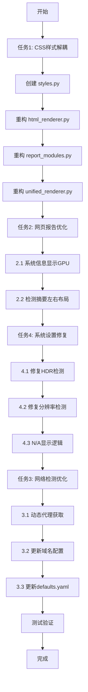

# OOPS 项目优化实施计划

## 概述

本文档详细描述了对 OOPS 项目进行的四大优化任务的实施计划。

---

## 任务 1: HTML 样式解耦

### 1.1 现状分析

当前 HTML 样式分散在多个文件中：
- [`html_renderer.py`](oops/core/html_renderer.py:275-449) - `_get_styles()` 方法包含约 170 行 CSS
- [`html_renderer.py`](oops/core/html_renderer.py:879-1102) - `_get_html_header()` 方法包含约 220 行内联 CSS
- [`unified_renderer.py`](oops/core/unified_renderer.py) - 使用 CSS 变量但依赖 html_renderer 的样式
- [`report_modules.py`](oops/core/report_modules.py) - 使用内联样式标签

### 1.2 解决方案

创建新文件 `oops/core/styles.py`，集中管理所有 CSS 样式：

```python
# oops/core/styles.py
"""
集中管理的 CSS 样式模块
所有 HTML 报告的样式在此统一定义
"""

class ReportStyles:
    """报告样式管理器"""
    
    @staticmethod
    def get_css_variables() -> str:
        """CSS 变量定义"""
        ...
    
    @staticmethod
    def get_base_styles() -> str:
        """基础样式"""
        ...
    
    @staticmethod
    def get_component_styles() -> str:
        """组件样式（卡片、按钮、表格等）"""
        ...
    
    @staticmethod
    def get_detection_styles() -> str:
        """检测结果相关样式"""
        ...
    
    @staticmethod
    def get_responsive_styles() -> str:
        """响应式设计样式"""
        ...
    
    @staticmethod
    def get_full_stylesheet() -> str:
        """获取完整样式表"""
        return f"""
        {ReportStyles.get_css_variables()}
        {ReportStyles.get_base_styles()}
        {ReportStyles.get_component_styles()}
        {ReportStyles.get_detection_styles()}
        {ReportStyles.get_responsive_styles()}
        """
```

### 1.3 重构步骤

1. 创建 `oops/core/styles.py`
2. 将 `html_renderer.py` 中的 `_get_styles()` 和 `_get_html_header()` 中的样式迁移
3. 更新 `html_renderer.py` 引用新的样式模块
4. 更新 `report_modules.py` 和 `unified_renderer.py` 引用新的样式模块
5. 添加必要的检测结果专用样式（如 `.indent-item` 等）

---

## 任务 1.1: @dataclass 管理模块间信息传递评估

### 现状分析

当前项目已经使用了 `@dataclass`，主要在 [`data_models.py`](oops/core/data_models.py)：

- [`DiagnosticReport`](oops/core/data_models.py:32-100) - 诊断报告顶层结构
- [`CheckResultData`](oops/core/data_models.py:103-117) - 检测结果数据
- [`SystemInfoData`](oops/core/data_models.py:120-146) - 系统信息数据
- [`CheckResult`](oops/core/diagnostics.py:37-48) - 在 diagnostics.py 中定义

### 问题点

1. **数据类型不一致**：部分地方使用 `Dict[str, Any]`，部分使用 `@dataclass`
2. **重复定义**：`CheckResult` 在 `diagnostics.py` 和 `data_models.py` 中有类似定义
3. **类型安全性不足**：大量使用 `Dict[str, Any]` 导致类型检查困难

### 改进建议

```python
# 统一的检测结果数据类
@dataclass
class DetectionItem:
    """单个检测项"""
    name: str
    status: str  # success | warning | error
    message: str
    details: Optional[Dict[str, Any]] = None

@dataclass
class DetectionResult:
    """检测器输出结果"""
    check_name: str
    status: str
    severity: str
    message: str
    success_items: List[DetectionItem] = field(default_factory=list)
    warning_items: List[DetectionItem] = field(default_factory=list)
    error_items: List[DetectionItem] = field(default_factory=list)
    fix_suggestion: str = ""
    execution_time: float = 0.0

@dataclass
class NetworkCheckResult:
    """网络检测结果"""
    url: str
    status: str
    response_time_ms: float
    type: str  # git_repo | pypi_source | github_proxy | etc.
    error: Optional[str] = None
    status_code: Optional[int] = None

@dataclass
class SystemSettingsResult:
    """系统设置检测结果"""
    hdr_enabled: Optional[bool] = None
    night_light_enabled: Optional[bool] = None
    color_filter_enabled: Optional[bool] = None
    primary_resolution: Optional[str] = None
    is_admin: Optional[bool] = None
```

### 评估结论

**建议采用渐进式改进**：
- 短期：保持现有结构，仅在新增功能时使用 dataclass
- 中期：统一检测结果的数据结构
- 长期：全面迁移到类型安全的 dataclass 架构

---

## 任务 2: 网页报告优化

### 2.1 系统信息未展开时显示显卡信息

**当前实现** ([`report_modules.py:57-71`](oops/core/report_modules.py:57-71))：

```python
# 当前摘要只显示 CPU、内存、磁盘、系统
if hardware.get("cpu_model"):
    summary_parts.append(f"CPU: {hardware['cpu_model']}")
if hardware.get("memory_total"):
    summary_parts.append(f"内存: {hardware['memory_total']}")
if storage.get("disk_type"):
    summary_parts.append(f"磁盘: {storage['disk_type']}")
if basic.get("os"):
    summary_parts.append(f"系统: {basic['os']}")
```

**修改方案**：

```python
# 添加 GPU 信息到摘要
if hardware.get("gpu_info"):
    gpu_info = hardware['gpu_info']
    # 截取显卡名称的关键部分（避免过长）
    if len(gpu_info) > 30:
        gpu_info = gpu_info[:27] + "..."
    summary_parts.append(f"GPU: {gpu_info}")
```

### 2.2 检测摘要改为左右布局

**当前实现** ([`report_modules.py:266-284`](oops/core/report_modules.py:266-284))：

```html
<div class="summary-stats">
    <span>总检测项: {value}</span>
    ...
</div>
```

**修改方案**：

```html
<div class="summary-stats-grid">
    <div class="stat-item">
        <span class="stat-label">总检测项</span>
        <span class="stat-value">{value}</span>
    </div>
    <div class="stat-item">
        <span class="stat-label">成功完成</span>
        <span class="stat-value">{value}</span>
    </div>
    ...
</div>
```

**新增 CSS 样式**：

```css
.summary-stats-grid {
    display: grid;
    grid-template-columns: repeat(auto-fit, minmax(150px, 1fr));
    gap: 15px;
    padding: 15px;
    background: #f9fafb;
    border-radius: 8px;
}

.stat-item {
    display: flex;
    justify-content: space-between;
    align-items: center;
    padding: 10px 15px;
    background: white;
    border-radius: 6px;
    box-shadow: 0 1px 2px rgba(0,0,0,0.05);
}

.stat-label {
    font-weight: 500;
    color: var(--text-secondary);
}

.stat-value {
    font-weight: 700;
    font-size: 1.2em;
    color: var(--primary-color);
}
```

---

## 任务 3: 网络连通性检测优化

### 3.1 参考 ghproxy_service.py 实现动态获取代理地址

**参考实现** ([`ghproxy_service.py`](ZenlessZoneZero-OneDragon-v2.3.3-Full-Environment/src/one_dragon/envs/ghproxy_service.py:13-53))：

该实现从 `https://ghproxy.link/js/src_views_home_HomeView_vue.js` 动态获取最新的代理地址。

**新增功能设计**：

```python
# oops/detectors/network.py 新增方法

class GhProxyUpdater:
    """GitHub 代理地址动态更新器"""
    
    PROXY_JS_URL = 'https://ghproxy.link/js/src_views_home_HomeView_vue.js'
    
    @classmethod
    async def fetch_latest_proxy(cls) -> Optional[str]:
        """从 ghproxy.link 获取最新的代理地址"""
        try:
            async with aiohttp.ClientSession() as session:
                async with session.get(cls.PROXY_JS_URL, timeout=aiohttp.ClientTimeout(total=10)) as response:
                    if response.status != 200:
                        return None
                    
                    js_content = await response.text()
                    
                    # 解析 JS 内容提取代理 URL
                    url_prefix = '<a href=\\\\\\"'
                    url_prefix_idx = js_content.find(url_prefix)
                    if url_prefix_idx == -1:
                        return None
                    
                    url_suffix = '\\\\\\" target='
                    url_suffix_idx = js_content.find(url_suffix)
                    if url_suffix_idx == -1:
                        return None
                    
                    proxy_url = js_content[url_prefix_idx + len(url_prefix):url_suffix_idx]
                    
                    # 验证 URL 格式
                    import re
                    pattern = r'^https://[a-zA-Z0-9.-]+\.[a-zA-Z]{2,}$'
                    if re.match(pattern, proxy_url):
                        return proxy_url
                    
                    return None
        except Exception:
            return None
```

### 3.2 更新 ghproxy.com 域名

**当前配置** ([`defaults.yaml:71-77`](configs/defaults.yaml:71-77))：

```yaml
github_proxies:
  - url: https://ghproxy.com
    name: ghproxy.com
    type: github_proxy
  - url: https://mirror.ghproxy.com
    name: mirror.ghproxy.com
    type: github_proxy
```

**更新方案**：

```yaml
github_proxies:
  # 动态代理（优先级最高，从 ghproxy.link 动态获取）
  - url: dynamic  # 标记为动态获取
    name: ghproxy.link（动态）
    type: github_proxy
    dynamic: true
  # 静态代理备用
  - url: https://gh-proxy.com
    name: gh-proxy.com
    type: github_proxy
  - url: https://ghfast.top
    name: ghfast.top
    type: github_proxy
  - url: https://mirror.ghproxy.com
    name: mirror.ghproxy.com
    type: github_proxy
```

### 3.3 网络检测器修改

在 [`NetworkConnectivityDetector.check_async()`](oops/detectors/network.py:32) 方法中添加动态代理获取逻辑：

```python
async def check_async(self, config: Dict[str, Any]) -> Dict[str, Any]:
    # ... 现有代码 ...
    
    # 动态获取 GitHub 代理地址
    github_proxies = merged_config.get("github_proxies", [])
    dynamic_proxies = [p for p in github_proxies if p.get("dynamic")]
    
    if dynamic_proxies:
        latest_proxy = await GhProxyUpdater.fetch_latest_proxy()
        if latest_proxy:
            # 将动态获取的代理添加到检测列表
            github_proxies = [
                {"url": latest_proxy, "name": "动态代理", "type": "github_proxy"}
            ] + [p for p in github_proxies if not p.get("dynamic")]
    
    # ... 继续现有检测逻辑 ...
```

---

## 任务 4: 系统设置检测修复

### 4.1 问题分析

**当前问题**：在 4K 屏幕开启 HDR 时：
- HDR 检测报告为"禁用"（应该是"启用"）
- 分辨率报告为 1920x1080（应该是 3840x2160 或类似）

**根本原因**：

1. **HDR 检测** ([`system_settings.py:153-181`](oops/detectors/system_settings.py:153-181))：
   - 当前使用注册表路径可能在某些 Windows 版本/配置下不正确
   - HDR 状态可能存储在不同位置

2. **分辨率检测** ([`hardware.py:270-293`](oops/detectors/hardware.py:270-293) 和 [`system_settings.py:241-259`](oops/detectors/system_settings.py:241-259))：
   - 使用 `System.Windows.Forms.Screen.PrimaryScreen.Bounds` 
   - 在 DPI 缩放环境下可能返回缩放后的"逻辑分辨率"而非物理分辨率

### 4.2 修复方案

#### HDR 检测改进

```python
def _check_hdr_windows(self) -> Optional[bool]:
    """检测Windows HDR状态 - 改进版"""
    try:
        # 方法1: 使用 WMI 查询显示器 HDR 支持状态
        ps_command = """
        try {
            # 方法1: 注册表检测
            $videoSettingsPath = 'HKCU:\\Software\\Microsoft\\Windows\\CurrentVersion\\VideoSettings'
            if (Test-Path $videoSettingsPath) {
                $hdrValue = Get-ItemProperty -Path $videoSettingsPath -Name 'EnableHDR' -ErrorAction SilentlyContinue
                if ($hdrValue -and $hdrValue.EnableHDR -eq 1) {
                    Write-Output "HDR_ENABLED"
                    exit
                }
            }
            
            # 方法2: 检测 AdvancedColorInfo
            Add-Type -AssemblyName System.Runtime.WindowsRuntime
            $asyncInfo = [Windows.Graphics.Display.DisplayInformation,Windows.Graphics.Display.DisplayInformation,ContentType=WindowsRuntime]
            # 这个方法在 UWP 应用中有效，但在控制台应用中可能需要其他方式
            
            Write-Output "HDR_DISABLED_OR_UNKNOWN"
        } catch {
            Write-Output "HDR_ERROR"
        }
        """
        result = subprocess.run(
            ["powershell", "-Command", ps_command],
            capture_output=True,
            text=True,
            timeout=self.timeout,
            creationflags=subprocess.CREATE_NO_WINDOW,
        )
        if result.returncode == 0:
            output = result.stdout.strip()
            if output == "HDR_ENABLED":
                return True
            elif output == "HDR_DISABLED_OR_UNKNOWN":
                return False
            else:
                return None  # 检测失败
    except Exception as e:
        logger.debug(f"检测HDR失败: {e}")
    return None  # 返回 None 表示无法确定
```

#### 分辨率检测改进

```python
def _get_primary_resolution_windows(self) -> Optional[str]:
    """获取Windows主显示器物理分辨率 - 改进版"""
    try:
        # 使用 Win32 API 获取物理分辨率，避免 DPI 缩放影响
        ps_command = """
        try {
            Add-Type @"
            using System;
            using System.Runtime.InteropServices;
            public class NativeMethods {
                [DllImport("user32.dll")]
                public static extern int GetSystemMetrics(int nIndex);
                
                [DllImport("user32.dll")]
                public static extern IntPtr GetDC(IntPtr hwnd);
                
                [DllImport("gdi32.dll")]
                public static extern int GetDeviceCaps(IntPtr hdc, int nIndex);
                
                [DllImport("user32.dll")]
                public static extern int ReleaseDC(IntPtr hwnd, IntPtr hdc);
            }
"@
            # 获取物理分辨率
            $hdc = [NativeMethods]::GetDC([IntPtr]::Zero)
            $DESKTOPHORZRES = 118  # 物理水平分辨率
            $DESKTOPVERTRES = 117  # 物理垂直分辨率
            
            $width = [NativeMethods]::GetDeviceCaps($hdc, $DESKTOPHORZRES)
            $height = [NativeMethods]::GetDeviceCaps($hdc, $DESKTOPVERTRES)
            
            [NativeMethods]::ReleaseDC([IntPtr]::Zero, $hdc)
            
            if ($width -gt 0 -and $height -gt 0) {
                Write-Output "$width x $height"
            } else {
                Write-Output "N/A"
            }
        } catch {
            Write-Output "N/A"
        }
        """
        result = subprocess.run(
            ["powershell", "-Command", ps_command],
            capture_output=True,
            text=True,
            timeout=self.timeout,
            creationflags=subprocess.CREATE_NO_WINDOW,
        )
        if result.returncode == 0:
            resolution = result.stdout.strip()
            if resolution and resolution != "N/A":
                return resolution
    except Exception as e:
        logger.debug(f"获取分辨率失败: {e}")
    return None  # 返回 None 而非假数据
```

### 4.3 检测失败时显示 N/A

修改 [`report_modules.py`](oops/core/report_modules.py) 和 [`unified_renderer.py`](oops/core/unified_renderer.py) 中的显示逻辑：

```python
# 在显示设置值之前检查是否为 None
def _format_setting_value(value: Any, setting_type: str) -> str:
    """格式化设置值，None 时显示 N/A"""
    if value is None:
        return "N/A"
    
    if setting_type == "boolean":
        return "启用" if value else "禁用"
    elif setting_type == "resolution":
        return str(value)
    else:
        return str(value)
```

同时更新数据收集逻辑，在检测失败时保持 `None` 而非填充假数据：

```python
# system_settings.py 和 hardware.py 中
# 确保检测失败时返回 None，而非默认值
settings["hdr_enabled"] = self._check_hdr_windows()  # 可能返回 None
settings["primary_resolution"] = self._get_primary_resolution_windows()  # 可能返回 None
```

---

## 实施顺序建议



---

## 文件修改清单

| 文件 | 修改类型 | 涉及任务 |
|------|----------|----------|
| `oops/core/styles.py` | 新建 | 任务1 |
| `oops/core/html_renderer.py` | 重构 | 任务1, 任务2 |
| `oops/core/report_modules.py` | 重构 | 任务1, 任务2 |
| `oops/core/unified_renderer.py` | 重构 | 任务1 |
| `oops/detectors/network.py` | 修改 | 任务3 |
| `oops/detectors/system_settings.py` | 修改 | 任务4 |
| `oops/detectors/hardware.py` | 修改 | 任务4 |
| `configs/defaults.yaml` | 修改 | 任务3 |

---

## 风险评估

| 风险 | 影响 | 缓解措施 |
|------|------|----------|
| CSS 解耦可能导致样式丢失 | 高 | 逐步迁移，每次修改后测试 |
| HDR/分辨率检测在不同Windows版本表现不一致 | 中 | 多版本测试，失败时返回 N/A |
| 动态代理获取可能失败 | 低 | 保留静态备用代理 |
| ghproxy.link 网站结构变化 | 低 | 添加错误处理和日志 |

---

## 测试计划

1. **单元测试**：为新的 `styles.py` 和 `GhProxyUpdater` 添加单元测试
2. **集成测试**：在不同配置下测试完整报告生成
3. **手动测试**：
   - 在 4K + HDR 环境下测试系统设置检测
   - 测试网络检测的动态代理功能
   - 验证 HTML 报告样式正确显示