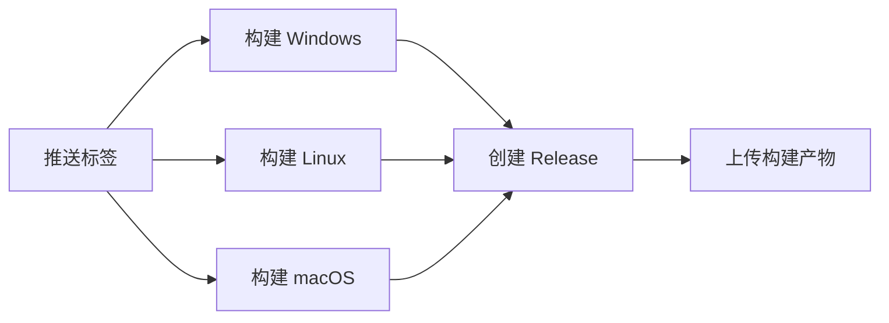

# GitHub Actions 自动化工作流

## 📋 工作流概览

OOPS 使用 GitHub Actions 实现自动化构建、测试和发布。

---

## 🚀 Release Workflow (发布工作流)

### 触发条件
- **自动触发**: 推送版本标签（如 `v1.0.0`）
- **手动触发**: 在 GitHub Actions 页面手动运行

### 工作流程



### 构建产物
- `oops-windows-x64.exe` - Windows 可执行文件
- `oops-linux-x64` - Linux 可执行文件
- `oops-macos-x64` - macOS 可执行文件

### 使用方法

#### 1. 创建版本标签
```bash
# 确保代码已提交
git add .
git commit -m "feat: 准备发布 v1.0.0"

# 创建标签
git tag -a v1.0.0 -m "OOPS v1.0.0 - 首个正式版本"

# 推送标签（触发自动构建）
git push origin v1.0.0
```

#### 2. 查看构建进度
1. 访问 GitHub 仓库
2. 点击 "Actions" 标签
3. 查看 "Build and Release" 工作流

#### 3. 发布完成
- 自动创建 GitHub Release
- 上传所有平台的可执行文件
- 生成发布说明

---

## 🧪 CI Workflow (持续集成工作流)

### 触发条件
- 推送到 `main` 或 `dev` 分支
- 创建 Pull Request

### 检查项目

#### 1. 测试 (Test)
- **多Python版本**: 3.8, 3.9, 3.10, 3.11
- **多操作系统**: Ubuntu, Windows
- **测试覆盖率**: 自动上传到 Codecov

```bash
# 本地运行测试
pytest tests/ -v --cov=oops
```

#### 2. 代码质量 (Lint)
- **Black**: 代码格式检查
- **isort**: 导入排序检查
- **flake8**: 代码规范检查
- **mypy**: 类型检查

```bash
# 本地运行检查
black --check oops/
isort --check-only oops/
flake8 oops/
mypy oops/
```

#### 3. 构建测试 (Build Test)
- 测试 PyInstaller 构建
- 验证可执行文件生成

```bash
# 本地测试构建
pyinstaller --clean --noconfirm build/config/build.spec
```

---

## 📝 配置文件

### Release Workflow
**文件**: `.github/workflows/release.yml`

**关键配置**:
```yaml
on:
  push:
    tags:
      - 'v*.*.*'  # 版本标签格式
  workflow_dispatch:  # 允许手动触发
```

### CI Workflow
**文件**: `.github/workflows/ci.yml`

**关键配置**:
```yaml
on:
  push:
    branches: [ main, dev ]
  pull_request:
    branches: [ main, dev ]
```

---

## 🔧 本地开发流程

### 1. 开发新功能
```bash
# 创建功能分支
git checkout -b feature/new-feature

# 开发和测试
# ... 编写代码 ...

# 运行测试
pytest tests/

# 代码格式化
black oops/
isort oops/

# 提交代码
git add .
git commit -m "feat: 添加新功能"
git push origin feature/new-feature
```

### 2. 创建 Pull Request
1. 在 GitHub 上创建 PR
2. 等待 CI 检查通过
3. 代码审查
4. 合并到 main 分支

### 3. 发布新版本
```bash
# 更新版本号
# 编辑 oops/__init__.py 中的 __version__

# 更新 CHANGELOG.md
# 添加新版本的更新内容

# 提交更改
git add .
git commit -m "chore: 准备发布 v1.1.0"
git push origin main

# 创建并推送标签
git tag -a v1.1.0 -m "OOPS v1.1.0"
git push origin v1.1.0

# 等待自动构建和发布
```

---

## 🐛 故障排除

### 构建失败

#### 问题: PyInstaller 构建失败
**解决方案**:
1. 检查 `build/config/build.spec` 配置
2. 确保所有依赖都在 `requirements.txt` 中
3. 本地测试构建：`pyinstaller --clean build/config/build.spec`

#### 问题: 测试失败
**解决方案**:
1. 本地运行测试：`pytest tests/ -v`
2. 检查测试日志
3. 修复失败的测试

#### 问题: 代码质量检查失败
**解决方案**:
```bash
# 自动修复格式问题
black oops/
isort oops/

# 检查剩余问题
flake8 oops/
```

### Release 创建失败

#### 问题: 标签已存在
**解决方案**:
```bash
# 删除本地标签
git tag -d v1.0.0

# 删除远程标签
git push origin :refs/tags/v1.0.0

# 重新创建标签
git tag -a v1.0.0 -m "新的发布说明"
git push origin v1.0.0
```

#### 问题: 权限不足
**解决方案**:
- 确保仓库设置中启用了 Actions
- 检查 `GITHUB_TOKEN` 权限

---

## 📊 监控和统计

### GitHub Actions 页面
- 查看所有工作流运行历史
- 下载构建日志
- 查看测试覆盖率

### Codecov (可选)
- 自动上传测试覆盖率
- 生成覆盖率报告
- PR 中显示覆盖率变化

---

## 🔐 安全性

### Secrets 管理
- `GITHUB_TOKEN`: 自动提供，用于创建 Release
- 不要在代码中硬编码敏感信息
- 使用 GitHub Secrets 存储敏感配置

### 依赖安全
- 定期更新依赖
- 使用 Dependabot 自动检查依赖更新
- 审查依赖的安全漏洞

---

## 📚 相关文档

- **[构建文档](../../build/docs/BUILD.md)** - 本地构建说明
- **[发布检查清单](RELEASE_CHECKLIST_v1.0.0.md)** - 发布前检查
- **[开发者指南](DEVELOPER_GUIDE.md)** - 开发规范

---

## 🎯 最佳实践

### 版本号规范
遵循语义化版本 (Semantic Versioning):
- `v1.0.0` - 主版本.次版本.修订号
- `v1.0.0-beta.1` - 预发布版本
- `v1.0.0-rc.1` - 候选版本

### 提交信息规范
```
feat: 新功能
fix: 修复bug
docs: 文档更新
style: 代码格式
refactor: 重构
test: 测试相关
chore: 构建/工具相关
```

### 分支策略
- `main` - 稳定版本
- `dev` - 开发版本
- `feature/*` - 功能分支
- `hotfix/*` - 紧急修复

---

**自动化让发布更简单！** 🚀
