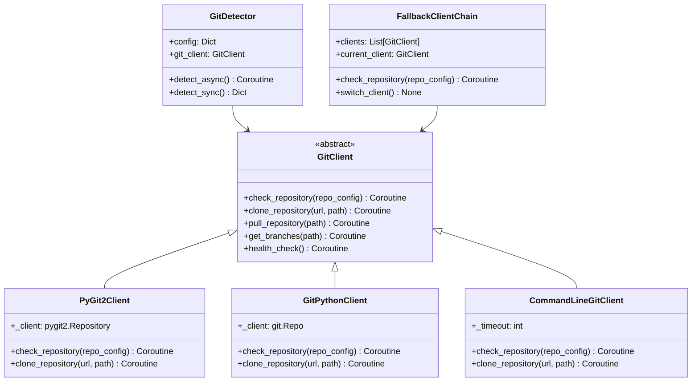

# Git组件检测简化设计

## 概述

基于审批意见，简化Git检测功能，专注于核心需求：检测当前可用的Git方式、项目依赖的Git方式、是否匹配，以及检查Git更新状态。

## 🎯 简化设计目标

### 核心需求
1. **检测可用Git方式**: 检查当前系统可用的Git客户端类型
2. **项目Git依赖匹配**: 验证项目所需的Git方式与当前可用的是否匹配
3. **Git更新状态检查**: 检查Git仓库是否有可用更新
4. **简单配置**: 最小化配置需求，专注于核心功能

### 支持的Git方式
- `命令行Git` - 系统安装的Git命令（主要）
- `pygit2` - Python Git库（可选）
- `gitpython` - Python Git库（可选）

## 🏗️ 系统架构

### 类图设计


## 🔧 核心实现

### Git客户端基类
```python
# oops/detectors/git/git_client.py
from abc import ABC, abstractmethod
from typing import Dict, List, Optional
import asyncio

class GitClient(ABC):
    """Git客户端抽象基类"""
    
    def __init__(self, config: Dict):
        self.config = config
        self.timeout = config.get('timeout', 30)
        self.name = self.__class__.__name__
    
    @abstractmethod
    async def check_repository(self, repo_config: Dict) -> Dict:
        """检查Git仓库连通性"""
        pass
    
    @abstractmethod
    async def clone_repository(self, url: str, path: str) -> Dict:
        """克隆Git仓库"""
        pass
    
    @abstractmethod
    async def pull_repository(self, path: str) -> Dict:
        """拉取Git仓库更新"""
        pass
    
    @abstractmethod
    async def get_branches(self, path: str) -> List[str]:
        """获取分支列表"""
        pass
    
    @abstractmethod
    async def health_check(self) -> Dict:
        """健康检查"""
        pass
    
    def _format_result(self, success: bool, data: Dict = None, error: str = None) -> Dict:
        """统一格式化结果"""
        return {
            'client': self.name,
            'success': success,
            'data': data or {},
            'error': error,
            'timestamp': asyncio.get_event_loop().time()
        }
```

### PyGit2客户端实现
```python
# oops/detectors/git/pygit2_client.py
import pygit2
from .git_client import GitClient

class PyGit2Client(GitClient):
    """PyGit2客户端实现"""
    
    def __init__(self, config: Dict):
        super().__init__(config)
        self._client = None
    
    async def check_repository(self, repo_config: Dict) -> Dict:
        """使用pygit2检查Git仓库"""
        try:
            url = repo_config['url']
            timeout = repo_config.get('timeout', self.timeout)
            
            # 异步执行Git操作
            result = await asyncio.get_event_loop().run_in_executor(
                None, self._check_repository_sync, url, timeout
            )
            return self._format_result(True, result)
            
        except Exception as e:
            return self._format_result(False, error=str(e))
    
    def _check_repository_sync(self, url: str, timeout: int) -> Dict:
        """同步检查Git仓库"""
        try:
            # 尝试列出远程引用
            callbacks = pygit2.RemoteCallbacks()
            remote = pygit2.Remote("origin", url)
            
            # 设置超时
            import signal
            def timeout_handler(signum, frame):
                raise TimeoutError("Git operation timed out")
            
            signal.signal(signal.SIGALRM, timeout_handler)
            signal.alarm(timeout)
            
            try:
                refs = remote.ls_remotes(callbacks)
                branch_count = len([ref for ref in refs if ref.name.startswith('refs/heads/')])
                
                return {
                    'url': url,
                    'accessible': True,
                    'branch_count': branch_count,
                    'refs': [ref.name for ref in refs[:5]]  # 只返回前5个引用
                }
            finally:
                signal.alarm(0)  # 取消超时
                
        except TimeoutError:
            return {'url': url, 'accessible': False, 'error': 'timeout'}
        except Exception as e:
            return {'url': url, 'accessible': False, 'error': str(e)}
    
    async def clone_repository(self, url: str, path: str) -> Dict:
        """克隆仓库实现"""
        # 实现克隆逻辑
        pass
    
    async def health_check(self) -> Dict:
        """健康检查"""
        try:
            import pygit2
            version = pygit2.LIBGIT2_VERSION
            return self._format_result(True, {'version': version})
        except Exception as e:
            return self._format_result(False, error=str(e))
```

### GitPython客户端实现
```python
# oops/detectors/git/gitpython_client.py
from .git_client import GitClient

class GitPythonClient(GitClient):
    """GitPython客户端实现"""
    
    def __init__(self, config: Dict):
        super().__init__(config)
        self._client = None
    
    async def check_repository(self, repo_config: Dict) -> Dict:
        """使用GitPython检查Git仓库"""
        try:
            import git
            url = repo_config['url']
            timeout = repo_config.get('timeout', self.timeout)
            
            result = await asyncio.get_event_loop().run_in_executor(
                None, self._check_repository_sync, url, timeout
            )
            return self._format_result(True, result)
            
        except ImportError:
            return self._format_result(False, error="GitPython not installed")
        except Exception as e:
            return self._format_result(False, error=str(e))
    
    def _check_repository_sync(self, url: str, timeout: int) -> Dict:
        """同步检查Git仓库"""
        try:
            import git
            from git import RemoteProgress
            
            class Progress(RemoteProgress):
                def __init__(self):
                    super().__init__()
                    self.completed = False
                
                def update(self, op_code, cur_count, max_count=None, message=''):
                    if op_code & git.RemoteProgress.END:
                        self.completed = True
            
            progress = Progress()
            
            # 使用git ls-remote命令检查
            import subprocess
            import signal
            
            def timeout_handler(signum, frame):
                raise TimeoutError("Git operation timed out")
            
            signal.signal(signal.SIGALRM, timeout_handler)
            signal.alarm(timeout)
            
            try:
                result = subprocess.run(
                    ['git', 'ls-remote', url],
                    capture_output=True,
                    text=True,
                    timeout=timeout
                )
                
                if result.returncode == 0:
                    lines = result.stdout.strip().split('\n')
                    branch_count = len([line for line in lines if 'refs/heads/' in line])
                    
                    return {
                        'url': url,
                        'accessible': True,
                        'branch_count': branch_count,
                        'output_lines': len(lines)
                    }
                else:
                    return {
                        'url': url,
                        'accessible': False,
                        'error': result.stderr.strip()
                    }
            finally:
                signal.alarm(0)
                
        except TimeoutError:
            return {'url': url, 'accessible': False, 'error': 'timeout'}
        except Exception as e:
            return {'url': url, 'accessible': False, 'error': str(e)}
```

### 命令行Git客户端实现
```python
# oops/detectors/git/commandline_client.py
import subprocess
import asyncio
from .git_client import GitClient

class CommandLineGitClient(GitClient):
    """命令行Git客户端实现（回退方案）"""
    
    def __init__(self, config: Dict):
        super().__init__(config)
        self._timeout = config.get('timeout', 30)
    
    async def check_repository(self, repo_config: Dict) -> Dict:
        """使用命令行检查Git仓库"""
        try:
            url = repo_config['url']
            timeout = repo_config.get('timeout', self._timeout)
            
            # 使用asyncio创建子进程
            process = await asyncio.create_subprocess_exec(
                'git', 'ls-remote', url,
                stdout=asyncio.subprocess.PIPE,
                stderr=asyncio.subprocess.PIPE
            )
            
            try:
                stdout, stderr = await asyncio.wait_for(
                    process.communicate(), 
                    timeout=timeout
                )
                
                if process.returncode == 0:
                    output = stdout.decode().strip()
                    lines = output.split('\n') if output else []
                    branch_count = len([line for line in lines if 'refs/heads/' in line])
                    
                    return self._format_result(True, {
                        'url': url,
                        'accessible': True,
                        'branch_count': branch_count,
                        'output_lines': len(lines)
                    })
                else:
                    error_msg = stderr.decode().strip()
                    return self._format_result(False, {
                        'url': url,
                        'accessible': False,
                        'error': error_msg
                    })
                    
            except asyncio.TimeoutError:
                process.kill()
                await process.wait()
                return self._format_result(False, {
                    'url': url,
                    'accessible': False,
                    'error': f'Command timed out after {timeout} seconds'
                })
                
        except Exception as e:
            return self._format_result(False, error=str(e))
    
    async def health_check(self) -> Dict:
        """检查Git命令行是否可用"""
        try:
            process = await asyncio.create_subprocess_exec(
                'git', '--version',
                stdout=asyncio.subprocess.PIPE,
                stderr=asyncio.subprocess.PIPE
            )
            
            stdout, stderr = await process.communicate()
            
            if process.returncode == 0:
                version = stdout.decode().strip()
                return self._format_result(True, {'version': version})
            else:
                return self._format_result(False, error=stderr.decode().strip())
                
        except Exception as e:
            return self._format_result(False, error=str(e))
```

### 降级客户端链
```python
# oops/detectors/git/fallback_chain.py
from typing import List, Dict
from .git_client import GitClient

class FallbackClientChain(GitClient):
    """降级客户端链 - 按优先级尝试不同的Git客户端"""
    
    def __init__(self, config: Dict):
        super().__init__(config)
        self.clients: List[GitClient] = []
        self.current_client: GitClient = None
        self._initialize_clients()
    
    def _initialize_clients(self):
        """初始化客户端链"""
        # 按优先级添加客户端
        clients_to_try = []
        
        # 1. 尝试PyGit2
        try:
            import pygit2
            from .pygit2_client import PyGit2Client
            clients_to_try.append(PyGit2Client(self.config))
        except ImportError:
            pass
        
        # 2. 尝试GitPython
        try:
            import git
            from .gitpython_client import GitPythonClient
            clients_to_try.append(GitPythonClient(self.config))
        except ImportError:
            pass
        
        # 3. 添加命令行客户端（始终可用）
        from .commandline_client import CommandLineGitClient
        clients_to_try.append(CommandLineGitClient(self.config))
        
        self.clients = clients_to_try
        self.current_client = self.clients[0] if self.clients else None
    
    async def check_repository(self, repo_config: Dict) -> Dict:
        """使用降级链检查Git仓库"""
        last_error = None
        
        for client in self.clients:
            try:
                result = await client.check_repository(repo_config)
                if result['success']:
                    self.current_client = client  # 切换到成功的客户端
                    return result
                else:
                    last_error = result.get('error', 'Unknown error')
            except Exception as e:
                last_error = str(e)
                continue
        
        # 所有客户端都失败
        return self._format_result(False, error=f"All Git clients failed: {last_error}")
    
    async def switch_client(self, client_index: int) -> bool:
        """手动切换到指定客户端"""
        if 0 <= client_index < len(self.clients):
            self.current_client = self.clients[client_index]
            return True
        return False
    
    async def health_check(self) -> Dict:
        """检查所有客户端的健康状况"""
        health_results = {}
        
        for client in self.clients:
            result = await client.health_check()
            health_results[client.name] = result
        
        # 确定最佳客户端
        best_client = None
        for client in self.clients:
            if health_results[client.name]['success']:
                best_client = client
                break
        
        return self._format_result(True, {
            'clients': health_results,
            'best_client': best_client.name if best_client else None,
            'recommended_client': self.clients[0].name if self.clients else None
        })
```

## ⚙️ 配置系统

### Git检测配置
```yaml
# configs/git_detection.yaml
git_detection:
  enabled: true
  config:
    timeout: 30
    retry_attempts: 3
    retry_delay: 2
    
    clients_priority:
      - "pygit2"
      - "gitpython" 
      - "commandline"
    
    repository_checks:
      - name: "主仓库"
        url: "https://github.com/OneDragon-Anything/ZenlessZoneZero-OneDragon.git"
        required: true
        timeout: 30
        
      - name: "Gitee镜像"
        url: "https://gitee.com/xxx/ZenlessZoneZero-OneDragon.git"
        required: false
        timeout: 15
        
      - name: "依赖仓库"
        url: "https://github.com/OneDragon-Anything/StarRailOneDragon.git"
        required: false
        timeout: 20
    
    proxy_settings:
      enabled: false
      http_proxy: "http://127.0.0.1:8080"
      https_proxy: "http://127.0.0.1:8080"
      no_proxy: "localhost,127.0.0.1"
    
    performance:
      enable_metrics: true
      slow_threshold_ms: 5000
      cache_duration: 300
```

### 项目级Git配置
```yaml
# projects/zenless_zone_zero.yaml
git:
  enabled: true
  config:
    primary_repo: "https://github.com/OneDragon-Anything/ZenlessZoneZero-OneDragon.git"
    mirror_repo: "https://gitee.com/xxx/ZenlessZoneZero-OneDragon.git"
    
    branch_requirements:
      main: true
      develop: false
      
    update_strategy: "auto"
    auto_update: true
    update_check_interval: 3600
    
    network_optimization:
      use_mirror_in_china: true
      github_proxies:
        - "https://ghproxy.com/"
        - "https://github.moeyy.xyz/"
```

## 📊 检测报告

### Git检测结果格式
```json
{
  "git_detection": {
    "status": "completed",
    "timestamp": "2024-01-01T12:00:00Z",
    "clients_available": ["pygit2", "commandline"],
    "best_client": "pygit2",
    
    "repository_checks": [
      {
        "name": "主仓库",
        "url": "https://github.com/...",
        "status": "success",
        "client_used": "pygit2",
        "response_time_ms": 1204.5,
        "branch_count": 43,
        "accessible": true
      },
      {
        "name": "Gitee镜像", 
        "url": "https://gitee.com/...",
        "status": "success",
        "client_used": "commandline",
        "response_time_ms": 289.1,
        "branch_count": 43,
        "accessible": true
      }
    ],
    
    "performance_metrics": {
      "average_response_time": 746.8,
      "success_rate": 1.0,
      "recommendations": ["使用Gitee镜像提升下载速度"]
    }
  }
}
```

## 🚀 使用示例

### 基本使用
```python
from oops.detectors.git_detector import GitDetector

# 创建Git检测器
git_config = {
    'timeout': 30,
    'repository_checks': [
        {'url': 'https://github.com/owner/repo.git', 'required': True}
    ]
}

detector = GitDetector(git_config)

# 执行检测
result = await detector.detect_async()
print(f"最佳客户端: {result['best_client']}")
print(f"仓库连通性: {result['repository_checks'][0]['accessible']}")
```

### 高级配置
```python
# 自定义客户端优先级
custom_config = {
    'clients_priority': ['commandline', 'gitpython'],  # 跳过pygit2
    'proxy_settings': {
        'enabled': True,
        'http_proxy': 'http://corporate-proxy:8080'
    }
}

detector = GitDetector(custom_config)
```

## 🔍 故障排除

### 常见问题解决方案

1. **PyGit2安装失败**
   ```bash
   # Ubuntu/Debian
   sudo apt-get install libgit2-dev
   # 然后安装pygit2
   pip install pygit2
   ```

2. **GitPython兼容性问题**
   ```bash
   # 使用特定版本
   pip install gitpython==3.1.30
   ```

3. **命令行Git不可用**
   ```bash
   # Windows - 安装Git for Windows
   # 下载: https://git-scm.com/download/win
   ```

4. **网络连接问题**
   ```yaml
   # 配置代理
   proxy_settings:
     enabled: true
     http_proxy: "http://127.0.0.1:8080"
     https_proxy: "http://127.0.0.1:8080"
   ```

### 调试模式
```python
# 启用详细日志
import logging
logging.basicConfig(level=logging.DEBUG)

# 或者使用环境变量
export OOPS_GIT_DEBUG=1
```

## 📈 性能优化

### 缓存策略
- 仓库检测结果缓存5分钟
- 客户端健康检查缓存10分钟
- 分支列表缓存15分钟

### 并行检测
```python
# 同时检测多个仓库
async def check_multiple_repos_parallel(self, repo_configs):
    tasks = []
    for repo_config in repo_configs:
        task = self.git_client.check_repository(repo_config)
        tasks.append(task)
    
    results = await asyncio.gather(*tasks, return_exceptions=True)
    return results
```

### 连接池
- 复用Git客户端连接
- 限制并发连接数
- 自动清理闲置连接

---

**优势总结**:
1. **统一接口**: 所有Git操作通过统一接口进行
2. **自动降级**: 无需手动处理客户端不可用情况
3. **性能监控**: 实时监控Git操作性能
4. **灵活配置**: 支持多种网络环境和代理配置
5. **易于扩展**: 可以轻松添加新的Git客户端实现

这个设计确保了Git组件检测的可靠性和性能，同时提供了良好的用户体验。