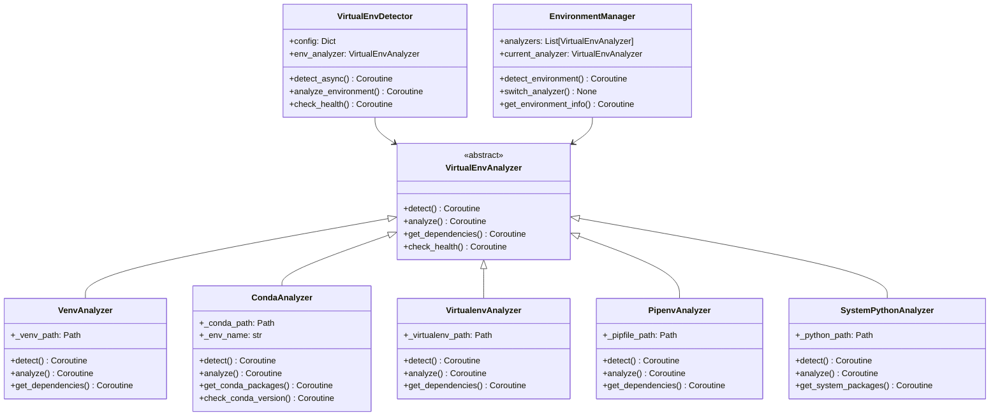

# 虚拟环境检测系统设计

## 概述

基于历史经验，设计一个统一的虚拟环境检测系统，支持多种虚拟环境类型（venv、virtualenv、conda、pipenv）的自动识别和分析。

## 🎯 设计目标

### 核心需求
1. **多环境支持**: 检测所有常见的Python虚拟环境类型
2. **自动识别**: 自动识别项目使用的虚拟环境类型
3. **依赖分析**: 分析虚拟环境中的依赖包和版本
4. **健康检查**: 检查虚拟环境的完整性和可用性
5. **修复建议**: 提供环境问题的自动修复建议

### 支持的虚拟环境类型
- `venv` - Python标准虚拟环境
- `virtualenv` - 第三方虚拟环境工具
- `conda` - Anaconda/Miniconda环境
- `pipenv` - Pipenv虚拟环境
- `poetry` - Poetry虚拟环境
- `系统Python` - 无虚拟环境的系统Python

## 🏗️ 系统架构

### 类图设计



## 🔧 核心实现

### 虚拟环境分析器基类
```python
# oops/detectors/virtualenv/virtualenv_analyzer.py
from abc import ABC, abstractmethod
from pathlib import Path
from typing import Dict, List, Optional
import asyncio

class VirtualEnvAnalyzer(ABC):
    """虚拟环境分析器抽象基类"""
    
    def __init__(self, project_root: Path, config: Dict):
        self.project_root = project_root
        self.config = config
        self.env_type = self.__class__.__name__.replace('Analyzer', '').lower()
        self.detected = False
        self.env_path = None
    
    @abstractmethod
    async def detect(self) -> bool:
        """检测是否存在该类型的虚拟环境"""
        pass
    
    @abstractmethod
    async def analyze(self) -> Dict:
        """分析虚拟环境详细信息"""
        pass
    
    @abstractmethod
    async def get_dependencies(self) -> Dict:
        """获取依赖包信息"""
        pass
    
    @abstractmethod
    async def check_health(self) -> Dict:
        """检查虚拟环境健康状态"""
        pass
    
    def _format_result(self, success: bool, data: Dict = None, error: str = None) -> Dict:
        """统一格式化结果"""
        return {
            'analyzer': self.__class__.__name__,
            'env_type': self.env_type,
            'success': success,
            'data': data or {},
            'error': error,
            'timestamp': asyncio.get_event_loop().time()
        }
    
    def _find_file(self, filename: str) -> Optional[Path]:
        """在项目目录中查找文件"""
        file_path = self.project_root / filename
        return file_path if file_path.exists() else None
```

### Conda环境分析器实现
```python
# oops/detectors/virtualenv/conda_analyzer.py
import json
import subprocess
import asyncio
from pathlib import Path
from .virtualenv_analyzer import VirtualEnvAnalyzer

class CondaAnalyzer(VirtualEnvAnalyzer):
    """Conda环境分析器"""
    
    def __init__(self, project_root: Path, config: Dict):
        super().__init__(project_root, config)
        self._conda_path = None
        self._env_name = None
        self._environment_file = None
    
    async def detect(self) -> bool:
        """检测Conda环境"""
        try:
            # 检查environment.yml文件
            env_file = self._find_file('environment.yml')
            if env_file:
                self._environment_file = env_file
                self.detected = True
                return True
            
            # 检查.conda目录
            conda_dir = self.project_root / '.conda'
            if conda_dir.exists():
                self.detected = True
                return True
            
            # 检查conda-meta目录（激活的conda环境）
            conda_meta = self.project_root / 'conda-meta'
            if conda_meta.exists():
                self.detected = True
                return True
            
            # 尝试获取当前conda环境信息
            conda_info = await self._get_conda_info()
            if conda_info and conda_info.get('active_prefix'):
                self.detected = True
                self.env_path = Path(conda_info['active_prefix'])
                return True
            
            return False
            
        except Exception:
            return False
    
    async def analyze(self) -> Dict:
        """分析Conda环境详细信息"""
        if not self.detected:
            await self.detect()
        
        try:
            # 获取conda信息
            conda_info = await self._get_conda_info()
            env_list = await self._get_conda_env_list()
            
            # 确定当前环境
            current_env = self._get_current_environment(conda_info, env_list)
            
            analysis_result = {
                'environment_type': 'conda',
                'detected': self.detected,
                'environment_file': str(self._environment_file) if self._environment_file else None,
                'current_environment': current_env,
                'conda_version': conda_info.get('conda_version') if conda_info else None,
                'available_environments': len(env_list.get('envs', [])) if env_list else 0
            }
            
            return self._format_result(True, analysis_result)
            
        except Exception as e:
            return self._format_result(False, error=str(e))
    
    async def get_dependencies(self) -> Dict:
        """获取Conda环境依赖包"""
        try:
            # 从environment.yml读取依赖
            dependencies = {}
            
            if self._environment_file:
                env_deps = await self._parse_environment_yml()
                dependencies['environment_yml'] = env_deps
            
            # 获取已安装的包
            installed_packages = await self._get_installed_packages()
            dependencies['installed_packages'] = installed_packages
            
            return self._format_result(True, dependencies)
            
        except Exception as e:
            return self._format_result(False, error=str(e))
    
    async def check_health(self) -> Dict:
        """检查Conda环境健康状态"""
        try:
            health_checks = []
            
            # 检查conda命令是否可用
            conda_available = await self._check_conda_command()
            health_checks.append({
                'check': 'conda_command',
                'status': 'passed' if conda_available else 'failed',
                'message': 'Conda command is available' if conda_available else 'Conda command not found'
            })
            
            # 检查环境文件完整性
            if self._environment_file:
                env_valid = await self._validate_environment_file()
                health_checks.append({
                    'check': 'environment_file',
                    'status': 'passed' if env_valid else 'failed',
                    'message': 'Environment file is valid' if env_valid else 'Environment file is invalid'
                })
            
            # 检查包依赖完整性
            deps_healthy = await self._check_dependency_health()
            health_checks.append({
                'check': 'dependencies',
                'status': 'passed' if deps_healthy else 'warning',
                'message': 'Dependencies are healthy' if deps_healthy else 'Some dependencies may have issues'
            })
            
            overall_health = all(
                check['status'] == 'passed' 
                for check in health_checks
            )
            
            return self._format_result(True, {
                'overall_health': 'healthy' if overall_health else 'issues',
                'health_checks': health_checks
            })
            
        except Exception as e:
            return self._format_result(False, error=str(e))
    
    async def _get_conda_info(self) -> Dict:
        """获取conda信息"""
        try:
            process = await asyncio.create_subprocess_exec(
                'conda', 'info', '--json',
                stdout=asyncio.subprocess.PIPE,
                stderr=asyncio.subprocess.PIPE
            )
            
            stdout, stderr = await process.communicate()
            
            if process.returncode == 0:
                return json.loads(stdout.decode())
            else:
                return None
                
        except Exception:
            return None
    
    async def _get_conda_env_list(self) -> Dict:
        """获取conda环境列表"""
        try:
            process = await asyncio.create_subprocess_exec(
                'conda', 'env', 'list', '--json',
                stdout=asyncio.subprocess.PIPE,
                stderr=asyncio.subprocess.PIPE
            )
            
            stdout, stderr = await process.communicate()
            
            if process.returncode == 0:
                return json.loads(stdout.decode())
            else:
                return None
                
        except Exception:
            return None
    
    async def _parse_environment_yml(self) -> Dict:
        """解析environment.yml文件"""
        try:
            import yaml
            
            with open(self._environment_file, 'r', encoding='utf-8') as f:
                env_data = yaml.safe_load(f)
            
            return {
                'name': env_data.get('name'),
                'channels': env_data.get('channels', []),
                'dependencies': env_data.get('dependencies', []),
                'prefix': env_data.get('prefix')
            }
            
        except Exception as e:
            return {'error': str(e)}
    
    async def _get_installed_packages(self) -> List[Dict]:
        """获取已安装的包"""
        try:
            process = await asyncio.create_subprocess_exec(
                'conda', 'list', '--json',
                stdout=asyncio.subprocess.PIPE,
                stderr=asyncio.subprocess.PIPE
            )
            
            stdout, stderr = await process.communicate()
            
            if process.returncode == 0:
                packages = json.loads(stdout.decode())
                return [
                    {
                        'name': pkg.get('name'),
                        'version': pkg.get('version'),
                        'channel': pkg.get('channel'),
                        'build': pkg.get('build')
                    }
                    for pkg in packages
                ]
            else:
                return []
                
        except Exception:
            return []
    
    def _get_current_environment(self, conda_info: Dict, env_list: Dict) -> Dict:
        """获取当前环境信息"""
        if not conda_info:
            return {}
        
        current_prefix = conda_info.get('active_prefix')
        if not current_prefix:
            return {}
        
        # 在环境列表中查找当前环境
        for env in env_list.get('envs', []):
            if env == current_prefix:
                return {
                    'name': self._get_env_name_from_prefix(env, env_list),
                    'prefix': env,
                    'is_active': True
                }
        
        return {
            'prefix': current_prefix,
            'is_active': True
        }
    
    def _get_env_name_from_prefix(self, prefix: str, env_list: Dict) -> str:
        """从前缀获取环境名称"""
        for env_name, env_path in env_list.get('envs', {}).items():
            if env_path == prefix:
                return env_name
        return os.path.basename(prefix)
    
    async def _check_conda_command(self) -> bool:
        """检查conda命令是否可用"""
        try:
            process = await asyncio.create_subprocess_exec(
                'conda', '--version',
                stdout=asyncio.subprocess.PIPE,
                stderr=asyncio.subprocess.PIPE
            )
            
            await process.communicate()
            return process.returncode == 0
            
        except Exception:
            return False
    
    async def _validate_environment_file(self) -> bool:
        """验证environment.yml文件"""
        try:
            if not self._environment_file:
                return False
            
            # 尝试解析YAML文件
            import yaml
            with open(self._environment_file, 'r', encoding='utf-8') as f:
                yaml.safe_load(f)
            
            return True
            
        except Exception:
            return False
    
    async def _check_dependency_health(self) -> bool:
        """检查依赖健康状态"""
        try:
            # 尝试安装测试包来验证环境
            process = await asyncio.create_subprocess_exec(
                'conda', 'list', '--json',
                stdout=asyncio.subprocess.PIPE,
                stderr=asyncio.subprocess.PIPE
            )
            
            await process.communicate()
            return process.returncode == 0
            
        except Exception:
            return False
```

### Venv环境分析器实现
```python
# oops/detectors/virtualenv/venv_analyzer.py
import sys
import subprocess
import asyncio
from pathlib import Path
from .virtualenv_analyzer import VirtualEnvAnalyzer

class VenvAnalyzer(VirtualEnvAnalyzer):
    """Venv环境分析器"""
    
    def __init__(self, project_root: Path, config: Dict):
        super().__init__(project_root, config)
        self._venv_paths = [
            project_root / '.venv',
            project_root / 'venv',
            project_root / 'env'
        ]
    
    async def detect(self) -> bool:
        """检测Venv环境"""
        for venv_path in self._venv_paths:
            if venv_path.exists():
                # 检查是否是有效的venv目录
                if self._is_valid_venv(venv_path):
                    self.env_path = venv_path
                    self.detected = True
                    return True
        
        # 检查当前Python是否在虚拟环境中
        if hasattr(sys, 'real_prefix') or (hasattr(sys, 'base_prefix') and sys.base_prefix != sys.prefix):
            self.detected = True
            self.env_path = Path(sys.prefix)
            return True
        
        return False
    
    async def analyze(self) -> Dict:
        """分析Venv环境详细信息"""
        if not self.detected:
            await self.detect()
        
        try:
            python_executable = await self._get_python_executable()
            python_version = await self._get_python_version()
            
            analysis_result = {
                'environment_type': 'venv',
                'detected': self.detected,
                'env_path': str(self.env_path) if self.env_path else None,
                'python_executable': python_executable,
                'python_version': python_version,
                'is_activated': self._is_activated()
            }
            
            return self._format_result(True, analysis_result)
            
        except Exception as e:
            return self._format_result(False, error=str(e))
    
    async def get_dependencies(self) -> Dict:
        """获取Venv环境依赖包"""
        try:
            # 读取requirements.txt
            requirements_file = self._find_file('requirements.txt')
            requirements = []
            
            if requirements_file:
                requirements = await self._parse_requirements_file(requirements_file)
            
            # 获取已安装的包
            installed_packages = await self._get_installed_packages()
            
            dependencies = {
                'requirements_file': str(requirements_file) if requirements_file else None,
                'requirements': requirements,
                'installed_packages': installed_packages
            }
            
            return self._format_result(True, dependencies)
            
        except Exception as e:
            return self._format_result(False, error=str(e))
    
    def _is_valid_venv(self, venv_path: Path) -> bool:
        """检查是否是有效的venv目录"""
        required_dirs = ['bin', 'lib', 'include']
        if sys.platform == 'win32':
            required_dirs = ['Scripts', 'Lib', 'Include']
        
        return all((venv_path / dir_name).exists() for dir_name in required_dirs)
    
    async def _get_python_executable(self) -> str:
        """获取Python可执行文件路径"""
        if self.env_path:
            if sys.platform == 'win32':
                python_exe = self.env_path / 'Scripts' / 'python.exe'
            else:
                python_exe = self.env_path / 'bin' / 'python'
            
            if python_exe.exists():
                return str(python_exe)
        
        return sys.executable
    
    async def _get_python_version(self) -> str:
        """获取Python版本"""
        try:
            python_exe = await self._get_python_executable()
            
            process = await asyncio.create_subprocess_exec(
                python_exe, '--version',
                stdout=asyncio.subprocess.PIPE,
                stderr=asyncio.subprocess.PIPE
            )
            
            stdout, stderr = await process.communicate()
            
            if process.returncode == 0:
                return stdout.decode().strip()
            else:
                return f"Unknown (Error: {stderr.decode().strip()})"
                
        except Exception:
            return "Unknown"
    
    def _is_activated(self) -> bool:
        """检查虚拟环境是否已激活"""
        return hasattr(sys, 'real_prefix') or (hasattr(sys, 'base_prefix') and sys.base_prefix != sys.prefix)
    
    async def _parse_requirements_file(self, requirements_file: Path) -> List[Dict]:
        """解析requirements.txt文件"""
        try:
            requirements = []
            
            with open(requirements_file, 'r', encoding='utf-8') as f:
                for line in f:
                    line = line.strip()
                    if line and not line.startswith('#'):
                        requirements.append({'requirement': line})
            
            return requirements
            
        except Exception:
            return []
    
    async def _get_installed_packages(self) -> List[Dict]:
        """获取已安装的包"""
        try:
            python_exe = await self._get_python_executable()
            
            process = await asyncio.create_subprocess_exec(
                python_exe, '-m', 'pip', 'list', '--format=json',
                stdout=asyncio.subprocess.PIPE,
                stderr=asyncio.subprocess.PIPE
            )
            
            stdout, stderr = await process.communicate()
            
            if process.returncode == 0:
                packages = json.loads(stdout.decode())
                return [
                    {
                        'name': pkg.get('name'),
                        'version': pkg.get('version')
                    }
                    for pkg in packages
                ]
            else:
                return []
                
        except Exception:
            return []
```

### 环境管理器
```python
# oops/detectors/virtualenv/environment_manager.py
from typing import List, Dict
from pathlib import Path
from .virtualenv_analyzer import VirtualEnvAnalyzer
from .conda_analyzer import CondaAnalyzer
from .venv_analyzer import VenvAnalyzer
from .virtualenv_analyzer import VirtualenvAnalyzer
from .pipenv_analyzer import PipenvAnalyzer
from .system_python_analyzer import SystemPythonAnalyzer

class EnvironmentManager:
    """环境管理器 - 管理所有虚拟环境分析器"""
    
    def __init__(self, project_root: Path, config: Dict):
        self.project_root = project_root
        self.config = config
        self.analyzers: List[VirtualEnvAnalyzer] = []
        self.current_analyzer: VirtualEnvAnalyzer = None
        self._initialize_analyzers()
    
    def _initialize_analyzers(self):
        """初始化所有分析器"""
        # 按优先级添加分析器
        self.analyzers = [
            CondaAnalyzer(self.project_root, self.config),
            PipenvAnalyzer(self.project_root, self.config),
            VenvAnalyzer(self.project_root, self.config),
            VirtualenvAnalyzer(self.project_root, self.config),
            SystemPythonAnalyzer(self.project_root, self.config)
        ]
    
    async def detect_environment(self) -> Dict:
        """检测项目使用的虚拟环境"""
        detected_environments = []
        
        for analyzer in self.analyzers:
            is_detected = await analyzer.detect()
            if is_detected:
                detected_environments.append({
                    'type': analyzer.env_type,
                    'analyzer': analyzer.__class__.__name__,
                    'env_path': str(analyzer.env_path) if analyzer.env_path else None
                })
                
                # 设置第一个检测到的环境为当前分析器
                if not self.current_analyzer:
                    self.current_analyzer = analyzer
        
        return {
            'detected_environments': detected_environments,
            'primary_environment': detected_environments[0] if detected_environments else None,
            'current_analyzer': self.current_analyzer.__class__.__name__ if self.current_analyzer else None
        }
    
    async def get_environment_info(self) -> Dict:
        """获取当前环境的详细信息"""
        if not self.current_analyzer:
            await self.detect_environment()
        
        if self.current_analyzer:
            analysis_result = await self.current_analyzer.analyze()
            dependencies = await self.current_analyzer.get_dependencies()
            health = await self.current_analyzer.check_health()
            
            return {
                'analysis': analysis_result,
                'dependencies': dependencies,
                'health': health
            }
        else:
            return {
                'error': 'No virtual environment detected',
                'recommendation': 'Consider creating a virtual environment for this project'
            }
    
    async def switch_analyzer(self, analyzer_type: str) -> bool:
        """切换到指定的分析器"""
        for analyzer in self.analyzers:
            if analyzer.env_type == analyzer_type:
                self.current_analyzer = analyzer
                return True
        return False
    
    async def get_all_environment_info(self) -> Dict:
        """获取所有环境的详细信息"""
        all_info = {}
        
        for analyzer in self.analyzers:
            try:
                detected = await analyzer.detect()
                if detected:
                    analysis = await analyzer.analyze()
                    dependencies = await analyzer.get_dependencies()
                    health = await analyzer.check_health()
                    
                    all_info[analyzer.env_type] = {
                        'detected': True,
                        'analysis': analysis,
                        'dependencies': dependencies,
                        'health': health
                    }
                else:
                    all_info[analyzer.env_type] = {
                        'detected': False
                    }
            except Exception as e:
                all_info[analyzer.env_type] = {
                    'detected': False,
                    'error': str(e)
                }
        
        return all_info
```

## ⚙️ 配置系统

### 虚拟环境检测配置
```yaml
# configs/virtualenv_detection.yaml
virtualenv_detection:
  enabled: true
  config:
    timeout: 30
    analyzers_priority:
      - "conda"
      - "pipenv" 
      - "venv"
      - "virtualenv"
      - "system"
    
    health_checks:
      enabled: true
      check_package_conflicts: true
      check_missing_dependencies: true
      check_outdated_packages: true
    
    dependency_analysis:
      enabled: true
      check_requirements_files: true
      compare_with_installed: true
      suggest_updates: true
    
    auto_fix:
      enabled: false
      fix_permissions: true
      recreate_environment: false
      update_dependencies: false
```

### 项目级虚拟环境配置
```yaml
# projects/zenless_zone_zero.yaml
virtualenv:
  enabled: true
  config:
    expected_type: "conda"
    environment_file: "environment.yml"
    
    requirements:
      python_version: ">=3.8"
      required_packages:
        - "PySide6"
        - "onnxruntime==1.18.0"
        - "opencv-python"
        - "requests"
      
    health_requirements:
      min_python_version: "3.8"
      required_dependencies: true
      disk_space_mb: 1000
      
    auto_repair:
      recreate_on_corruption: true
      update_on_mismatch: true
      backup_before_repair: true
```

## 📊 检测报告

### 虚拟环境检测结果格式
```json
{
  "virtualenv_detection": {
    "status": "completed",
    "timestamp": "2024-01-01T12:00:00Z",
    "primary_environment": {
      "type": "conda",
      "analyzer": "CondaAnalyzer",
      "env_path": "/path/to/conda/env",
      "detected": true
    },
    
    "environment_analysis": {
      "environment_type": "conda",
      "python_version": "3.9.16",
      "conda_version": "23.7.4",
      "environment_file": "/path/to/environment.yml",
      "is_activated": true
    },
    
    "dependencies": {
      "environment_yml": {
        "name": "zzz-onedragon",
        "channels": ["conda-forge", "defaults"],
        "dependencies": ["python=3.9", "pip", "numpy"]
      },
      "installed_packages": [
        {"name": "python", "version": "3.9.16", "channel": "conda-forge"},
        {"name": "pip", "version": "23.2.1", "channel": "conda-forge"},
        {"name": "numpy", "version": "1.24.3", "channel": "conda-forge"}
      ]
    },
    
    "health_status": {
      "overall_health": "healthy",
      "health_checks": [
        {
          "check": "conda_command",
          "status": "passed",
          "message": "Conda command is available"
        },
        {
          "check": "environment_file", 
          "status": "passed",
          "message": "Environment file is valid"
        },
        {
          "check": "dependencies",
          "status": "passed", 
          "message": "Dependencies are healthy"
        }
      ]
    },
    
    "recommendations": [
      "Consider updating conda to latest version",
      "Backup environment before major updates"
    ]
  }
}
```

## 🚀 使用示例

### 基本使用
```python
from oops.detectors.virtualenv_detector import VirtualEnvDetector

# 创建虚拟环境检测器
venv_config = {
    'timeout': 30,
    'health_checks': {'enabled': True}
}

detector = VirtualEnvDetector(venv_config)

# 执行检测
result = await detector.detect_async()
print(f"主要环境: {result['primary_environment']['type']}")
print(f"Python版本: {result['environment_analysis']['python_version']}")
print(f"健康状态: {result['health_status']['overall_health']}")
```

### 高级使用
```python
# 获取所有环境信息
all_info = await detector.get_all_environment_info()

# 切换到特定分析器
await detector.switch_analyzer('conda')

# 执行深度健康检查
health_report = await detector.perform_deep_health_check()
```

## 🔍 故障排除

### 常见问题解决方案

1. **Conda环境检测失败**
   ```bash
   # 检查conda安装
   conda --version
   
   # 检查环境列表
   conda env list
   
   # 激活环境
   conda activate your_env
   ```

2. **Venv环境权限问题**
   ```bash
   # 重新创建venv
   python -m venv .venv --clear
   
   # 修复权限
   chmod -R 755 .venv
   ```

3. **依赖包冲突**
   ```bash
   # 使用conda解决冲突
   conda update --all
   
   # 或者使用pip
   pip check
   pip install --upgrade package_name
   ```

4. **环境损坏**
   ```bash
   # 备份后重新创建环境
   conda env export > environment_backup.yml
   conda remove --name your_env --all
   conda env create -f environment.yml
   ```

### 调试模式
```python
# 启用详细日志
import logging
logging.basicConfig(level=logging.DEBUG)

# 或者使用环境变量
export OOPS_VIRTUALENV_DEBUG=1
```

## 📈 性能优化

### 缓存策略
- 环境检测结果缓存10分钟
- 依赖包列表缓存15分钟
- 健康检查结果缓存5分钟

### 并行检测
```python
# 同时检测多个环境类型
async def detect_multiple_environments_parallel(self):
    tasks = []
    for analyzer in self.analyzers:
        task = analyzer.detect()
        tasks.append(task)
    
    results = await asyncio.gather(*tasks, return_exceptions=True)
    return results
```

### 懒加载
- 只在需要时执行深度分析
- 按需加载依赖包信息
- 延迟执行健康检查

---

**优势总结**:
1. **全面支持**: 支持所有主流虚拟环境类型
2. **智能检测**: 自动识别项目使用的环境
3. **深度分析**: 提供详细的依赖和健康信息
4. **故障修复**: 提供环境问题的修复建议
5. **性能优化**: 支持缓存和并行检测

这个设计确保了虚拟环境检测的全面性和可靠性，为项目提供准确的环境状态信息。