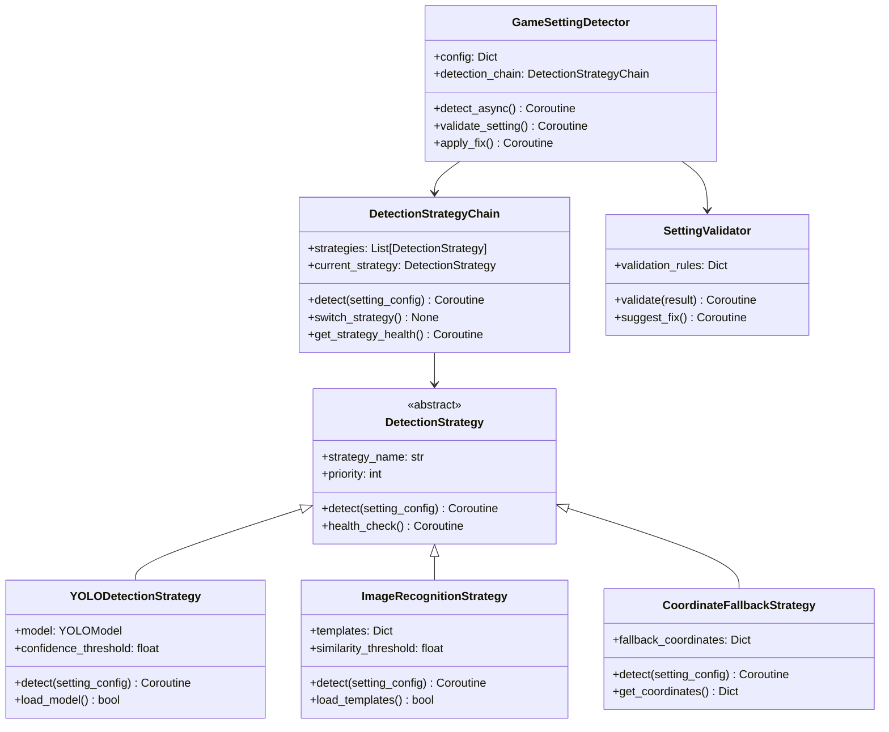

# 游戏设置检测的YOLO回退机制设计

## 概述

基于历史经验，设计一个智能的游戏设置检测系统，支持从YOLO对象检测自动降级到图像识别和坐标回退，确保在不同环境和配置下的可靠性。

## 🎯 设计目标

### 核心需求
1. **多策略检测**: 支持YOLO、图像识别、坐标点击等多种检测策略
2. **自动降级**: 当高级策略失败时自动降级到低级策略
3. **性能优化**: 根据环境自动选择最优检测策略
4. **容错处理**: 处理游戏窗口变化、分辨率调整等异常情况
5. **配置灵活**: 支持项目级配置和运行时调整

### 支持的检测策略
- `YOLO检测` - 使用YOLO模型进行对象检测（最高精度）
- `图像识别` - 使用模板匹配进行图像识别（中等精度）
- `坐标回退` - 使用预设坐标进行点击（最低精度但最可靠）

## 🏗️ 系统架构

### 类图设计


## 🔧 核心实现

### 检测策略基类
```python
# oops/plugins/game_setting_detector/strategies/detection_strategy.py
from abc import ABC, abstractmethod
from typing import Dict, List, Optional
import asyncio

class DetectionStrategy(ABC):
    """检测策略抽象基类"""
    
    def __init__(self, config: Dict):
        self.config = config
        self.strategy_name = self.__class__.__name__.replace('Strategy', '')
        self.priority = config.get('priority', 0)
        self.enabled = config.get('enabled', True)
    
    @abstractmethod
    async def detect(self, setting_config: Dict) -> Dict:
        """执行检测操作"""
        pass
    
    @abstractmethod
    async def health_check(self) -> Dict:
        """检查策略健康状态"""
        pass
    
    async def can_handle(self, setting_config: Dict) -> bool:
        """检查是否能处理该设置"""
        return self.enabled and await self._specific_can_handle(setting_config)
    
    async def _specific_can_handle(self, setting_config: Dict) -> bool:
        """特定策略的可用性检查"""
        return True
    
    def _format_result(self, success: bool, data: Dict = None, error: str = None) -> Dict:
        """统一格式化结果"""
        return {
            'strategy': self.strategy_name,
            'success': success,
            'data': data or {},
            'error': error,
            'timestamp': asyncio.get_event_loop().time()
        }
```

### YOLO检测策略实现
```python
# oops/plugins/game_setting_detector/strategies/yolo_strategy.py
import cv2
import numpy as np
from pathlib import Path
from .detection_strategy import DetectionStrategy

class YOLODetectionStrategy(DetectionStrategy):
    """YOLO对象检测策略"""
    
    def __init__(self, config: Dict):
        super().__init__(config)
        self.model = None
        self.confidence_threshold = config.get('confidence_threshold', 0.5)
        self.model_loaded = False
        self._initialize_model()
    
    def _initialize_model(self):
        """初始化YOLO模型"""
        try:
            model_path = self.config.get('model_path')
            if model_path and Path(model_path).exists():
                # 这里使用伪代码，实际需要根据YOLO实现来加载模型
                # self.model = YOLO(model_path)
                self.model_loaded = True
            else:
                self.model_loaded = False
        except Exception as e:
            print(f"YOLO模型加载失败: {e}")
            self.model_loaded = False
    
    async def detect(self, setting_config: Dict) -> Dict:
        """使用YOLO进行对象检测"""
        if not self.model_loaded:
            return self._format_result(False, error="YOLO模型未加载")
        
        try:
            # 获取游戏截图
            screenshot = await self._capture_screenshot()
            if screenshot is None:
                return self._format_result(False, error="无法获取游戏截图")
            
            # 使用YOLO进行检测
            detection_result = await self._run_yolo_detection(screenshot, setting_config)
            
            if detection_result['detected']:
                return self._format_result(True, detection_result)
            else:
                return self._format_result(False, detection_result, "未检测到目标对象")
                
        except Exception as e:
            return self._format_result(False, error=f"YOLO检测异常: {str(e)}")
    
    async def health_check(self) -> Dict:
        """检查YOLO策略健康状态"""
        health_checks = []
        
        # 检查模型加载状态
        model_health = {
            'check': 'model_loaded',
            'status': 'passed' if self.model_loaded else 'failed',
            'message': 'YOLO模型已加载' if self.model_loaded else 'YOLO模型未加载'
        }
        health_checks.append(model_health)
        
        # 检查模型文件
        model_path = self.config.get('model_path')
        if model_path:
            path_exists = Path(model_path).exists()
            path_health = {
                'check': 'model_file',
                'status': 'passed' if path_exists else 'failed',
                'message': f'模型文件存在: {model_path}' if path_exists else f'模型文件不存在: {model_path}'
            }
            health_checks.append(path_health)
        
        # 检查GPU支持（如果可用）
        gpu_available = await self._check_gpu_support()
        gpu_health = {
            'check': 'gpu_support',
            'status': 'passed' if gpu_available else 'warning',
            'message': 'GPU加速可用' if gpu_available else '使用CPU模式，性能可能较低'
        }
        health_checks.append(gpu_health)
        
        overall_health = all(
            check['status'] == 'passed' 
            for check in health_checks 
            if check['check'] in ['model_loaded', 'model_file']
        )
        
        return self._format_result(True, {
            'overall_health': 'healthy' if overall_health else 'unhealthy',
            'health_checks': health_checks
        })
    
    async def _capture_screenshot(self) -> Optional[np.ndarray]:
        """捕获游戏截图"""
        try:
            # 这里使用伪代码，实际需要根据游戏窗口捕获实现
            # 例如使用pyautogui、mss等库
            # screenshot = pyautogui.screenshot()
            # return cv2.cvtColor(np.array(screenshot), cv2.COLOR_RGB2BGR)
            return None
        except Exception:
            return None
    
    async def _run_yolo_detection(self, screenshot: np.ndarray, setting_config: Dict) -> Dict:
        """运行YOLO检测"""
        try:
            # 伪代码 - 实际YOLO检测实现
            # results = self.model(screenshot)
            # boxes = results.xyxy[0].cpu().numpy()
            
            # 过滤结果
            # detected_objects = []
            # for box in boxes:
            #     x1, y1, x2, y2, confidence, class_id = box
            #     if confidence > self.confidence_threshold:
            #         class_name = self.model.names[int(class_id)]
            #         detected_objects.append({
            #             'class': class_name,
            #             'confidence': float(confidence),
            #             'bbox': [float(x1), float(y1), float(x2), float(y2)],
            #             'center': [float((x1 + x2) / 2), float((y1 + y2) / 2)]
            #         })
            
            # 模拟检测结果
            detected_objects = [
                {
                    'class': 'settings_icon',
                    'confidence': 0.85,
                    'bbox': [100, 200, 150, 250],
                    'center': [125, 225]
                }
            ]
            
            # 根据设置配置过滤目标
            target_class = setting_config.get('target_class')
            filtered_objects = [
                obj for obj in detected_objects 
                if obj['class'] == target_class
            ]
            
            return {
                'detected': len(filtered_objects) > 0,
                'objects': filtered_objects,
                'all_objects': detected_objects,
                'screenshot_size': screenshot.shape[:2] if screenshot is not None else None
            }
            
        except Exception as e:
            return {
                'detected': False,
                'error': str(e),
                'objects': []
            }
    
    async def _check_gpu_support(self) -> bool:
        """检查GPU支持"""
        try:
            import torch
            return torch.cuda.is_available()
        except ImportError:
            return False
    
    async def _specific_can_handle(self, setting_config: Dict) -> bool:
        """检查YOLO策略是否能处理该设置"""
        # YOLO需要模型文件和目标类别定义
        has_model = self.model_loaded
        has_target_class = 'target_class' in setting_config
        
        return has_model and has_target_class
```

### 图像识别策略实现
```python
# oops/plugins/game_setting_detector/strategies/image_recognition_strategy.py
import cv2
import numpy as np
from pathlib import Path
from .detection_strategy import DetectionStrategy

class ImageRecognitionStrategy(DetectionStrategy):
    """图像识别策略（模板匹配）"""
    
    def __init__(self, config: Dict):
        super().__init__(config)
        self.templates = {}
        self.similarity_threshold = config.get('similarity_threshold', 0.8)
        self._load_templates()
    
    def _load_templates(self):
        """加载模板图像"""
        templates_config = self.config.get('templates', {})
        
        for template_name, template_path in templates_config.items():
            if Path(template_path).exists():
                try:
                    template = cv2.imread(template_path, cv2.IMREAD_GRAYSCALE)
                    if template is not None:
                        self.templates[template_name] = template
                except Exception as e:
                    print(f"加载模板失败 {template_name}: {e}")
    
    async def detect(self, setting_config: Dict) -> Dict:
        """使用图像识别进行检测"""
        if not self.templates:
            return self._format_result(False, error="没有可用的模板图像")
        
        try:
            # 获取游戏截图
            screenshot = await self._capture_screenshot()
            if screenshot is None:
                return self._format_result(False, error="无法获取游戏截图")
            
            # 转换为灰度图
            screenshot_gray = cv2.cvtColor(screenshot, cv2.COLOR_BGR2GRAY)
            
            # 根据配置选择模板
            template_name = setting_config.get('template_name')
            if template_name not in self.templates:
                return self._format_result(False, error=f"模板不存在: {template_name}")
            
            template = self.templates[template_name]
            
            # 执行模板匹配
            match_result = await self._template_match(screenshot_gray, template)
            
            if match_result['found']:
                return self._format_result(True, match_result)
            else:
                return self._format_result(False, match_result, "未找到匹配的模板")
                
        except Exception as e:
            return self._format_result(False, error=f"图像识别异常: {str(e)}")
    
    async def health_check(self) -> Dict:
        """检查图像识别策略健康状态"""
        health_checks = []
        
        # 检查模板加载状态
        templates_loaded = len(self.templates) > 0
        templates_health = {
            'check': 'templates_loaded',
            'status': 'passed' if templates_loaded else 'failed',
            'message': f'已加载 {len(self.templates)} 个模板' if templates_loaded else '没有加载任何模板'
        }
        health_checks.append(templates_health)
        
        # 检查模板文件
        templates_config = self.config.get('templates', {})
        missing_templates = []
        
        for template_name, template_path in templates_config.items():
            if not Path(template_path).exists():
                missing_templates.append(template_name)
        
        if missing_templates:
            files_health = {
                'check': 'template_files',
                'status': 'failed',
                'message': f'缺失模板文件: {", ".join(missing_templates)}'
            }
        else:
            files_health = {
                'check': 'template_files',
                'status': 'passed',
                'message': '所有模板文件都存在'
            }
        health_checks.append(files_health)
        
        overall_health = templates_loaded and len(missing_templates) == 0
        
        return self._format_result(True, {
            'overall_health': 'healthy' if overall_health else 'unhealthy',
            'health_checks': health_checks
        })
    
    async def _template_match(self, screenshot: np.ndarray, template: np.ndarray) -> Dict:
        """执行模板匹配"""
        try:
            # 执行模板匹配
            result = cv2.matchTemplate(screenshot, template, cv2.TM_CCOEFF_NORMED)
            min_val, max_val, min_loc, max_loc = cv2.minMaxLoc(result)
            
            if max_val >= self.similarity_threshold:
                # 计算匹配位置
                h, w = template.shape
                top_left = max_loc
                bottom_right = (top_left[0] + w, top_left[1] + h)
                center = (top_left[0] + w // 2, top_left[1] + h // 2)
                
                return {
                    'found': True,
                    'similarity': float(max_val),
                    'location': {
                        'top_left': top_left,
                        'bottom_right': bottom_right,
                        'center': center,
                        'width': w,
                        'height': h
                    }
                }
            else:
                return {
                    'found': False,
                    'similarity': float(max_val),
                    'threshold': self.similarity_threshold
                }
                
        except Exception as e:
            return {
                'found': False,
                'error': str(e)
            }
    
    async def _capture_screenshot(self) -> Optional[np.ndarray]:
        """捕获游戏截图（与YOLO策略共享）"""
        try:
            # 伪代码 - 实际截图实现
            # screenshot = pyautogui.screenshot()
            # return cv2.cvtColor(np.array(screenshot), cv2.COLOR_RGB2BGR)
            return None
        except Exception:
            return None
    
    async def _specific_can_handle(self, setting_config: Dict) -> bool:
        """检查图像识别策略是否能处理该设置"""
        # 图像识别需要模板名称和模板文件
        template_name = setting_config.get('template_name')
        has_template = template_name in self.templates
        
        return has_template
```

### 坐标回退策略实现
```python
# oops/plugins/game_setting_detector/strategies/coordinate_fallback_strategy.py
from .detection_strategy import DetectionStrategy

class CoordinateFallbackStrategy(DetectionStrategy):
    """坐标回退策略（最可靠的备选方案）"""
    
    def __init__(self, config: Dict):
        super().__init__(config)
        self.fallback_coordinates = config.get('fallback_coordinates', {})
    
    async def detect(self, setting_config: Dict) -> Dict:
        """使用坐标回退进行检测"""
        try:
            setting_name = setting_config.get('name')
            coordinates = self._get_coordinates(setting_name, setting_config)
            
            if not coordinates:
                return self._format_result(False, error=f"没有为 {setting_name} 定义回退坐标")
            
            # 验证坐标是否在屏幕范围内
            screen_valid = await self._validate_screen_coordinates(coordinates)
            if not screen_valid:
                return self._format_result(False, error="坐标不在有效屏幕范围内")
            
            # 执行点击或验证操作
            action_result = await self._perform_coordinate_action(coordinates, setting_config)
            
            return self._format_result(True, {
                'coordinates': coordinates,
                'action_performed': action_result.get('performed', False),
                'action_result': action_result
            })
                
        except Exception as e:
            return self._format_result(False, error=f"坐标回退异常: {str(e)}")
    
    async def health_check(self) -> Dict:
        """检查坐标回退策略健康状态"""
        health_checks = []
        
        # 检查坐标配置
        coordinates_defined = len(self.fallback_coordinates) > 0
        coordinates_health = {
            'check': 'coordinates_defined',
            'status': 'passed' if coordinates_defined else 'warning',
            'message': f'已定义 {len(self.fallback_coordinates)} 个回退坐标' if coordinates_defined else '没有定义回退坐标'
        }
        health_checks.append(coordinates_health)
        
        # 检查屏幕分辨率兼容性
        resolution_compatible = await self._check_resolution_compatibility()
        resolution_health = {
            'check': 'resolution_compatibility',
            'status': 'passed' if resolution_compatible else 'warning',
            'message': '坐标与当前屏幕分辨率兼容' if resolution_compatible else '坐标可能与当前屏幕分辨率不兼容'
        }
        health_checks.append(resolution_health)
        
        overall_health = coordinates_defined
        
        return self._format_result(True, {
            'overall_health': 'healthy' if overall_health else 'unhealthy',
            'health_checks': health_checks
        })
    
    def _get_coordinates(self, setting_name: str, setting_config: Dict) -> Dict:
        """获取设置对应的坐标"""
        # 优先使用设置特定的坐标
        specific_coords = setting_config.get('fallback_coordinates')
        if specific_coords:
            return specific_coords
        
        # 使用全局回退坐标
        return self.fallback_coordinates.get(setting_name, {})
    
    async def _validate_screen_coordinates(self, coordinates: Dict) -> bool:
        """验证坐标是否在屏幕范围内"""
        try:
            # 获取屏幕尺寸
            screen_width, screen_height = await self._get_screen_resolution()
            
            # 检查坐标是否在屏幕内
            for key, value in coordinates.items():
                if isinstance(value, (list, tuple)) and len(value) == 2:
                    x, y = value
                    if x < 0 or x >= screen_width or y < 0 or y >= screen_height:
                        return False
            
            return True
            
        except Exception:
            return True  # 如果无法获取屏幕分辨率，假设坐标有效
    
    async def _perform_coordinate_action(self, coordinates: Dict, setting_config: Dict) -> Dict:
        """执行坐标相关操作"""
        try:
            action_type = setting_config.get('action', 'click')
            
            if action_type == 'click':
                # 执行点击操作
                click_point = coordinates.get('click_point')
                if click_point:
                    # 伪代码 - 实际点击实现
                    # pyautogui.click(click_point[0], click_point[1])
                    return {'performed': True, 'action': 'click', 'point': click_point}
            
            elif action_type == 'verify':
                # 验证坐标位置
                verify_point = coordinates.get('verify_point')
                if verify_point:
                    # 伪代码 - 实际验证实现
                    # 可以截取小区域图像进行颜色验证等
                    return {'performed': True, 'action': 'verify', 'point': verify_point}
            
            return {'performed': False, 'action': action_type, 'reason': '未定义的操作类型'}
            
        except Exception as e:
            return {'performed': False, 'error': str(e)}
    
    async def _get_screen_resolution(self) -> tuple:
        """获取屏幕分辨率"""
        try:
            # 伪代码 - 实际获取屏幕分辨率
            # import pyautogui
            # return pyautogui.size()
            return (1920, 1080)  # 默认分辨率
        except Exception:
            return (1920, 1080)  # 回退分辨率
    
    async def _check_resolution_compatibility(self) -> bool:
        """检查坐标与屏幕分辨率的兼容性"""
        try:
            screen_width, screen_height = await self._get_screen_resolution()
            
            # 检查所有坐标是否在当前屏幕范围内
            for setting_name, coordinates in self.fallback_coordinates.items():
                for key, value in coordinates.items():
                    if isinstance(value, (list, tuple)) and len(value) == 2:
                        x, y = value
                        if x >= screen_width or y >= screen_height:
                            return False
            
            return True
            
        except Exception:
            return True  # 如果检查失败，假设兼容
    
    async def _specific_can_handle(self, setting_config: Dict) -> bool:
        """检查坐标回退策略是否能处理该设置"""
        # 坐标回退总是可用，但需要有定义的坐标
        setting_name = setting_config.get('name')
        has_specific_coords = 'fallback_coordinates' in setting_config
        has_global_coords = setting_name in self.fallback_coordinates
        
        return has_specific_coords or has_global_coords
```

### 检测策略链
```python
# oops/plugins/game_setting_detector/strategies/detection_chain.py
from typing import List, Dict
from .detection_strategy import DetectionStrategy

class DetectionStrategyChain:
    """检测策略链 - 管理多种检测策略的降级"""
    
    def __init__(self, config: Dict):
        self.config = config
        self.strategies: List[DetectionStrategy] = []
        self.current_strategy: DetectionStrategy = None
        self._initialize_strategies()
    
    def _initialize_strategies(self):
        """初始化所有检测策略"""
        strategy_configs = self.config.get('strategies', {})
        
        # 按优先级创建策略实例
        if strategy_configs.get('yolo', {}).get('enabled', True):
            from .yolo_strategy import YOLODetectionStrategy
            self.strategies.append(YOLODetectionStrategy(strategy_configs.get('yolo', {})))
        
        if strategy_configs.get('image_recognition', {}).get('enabled', True):
            from .image_recognition_strategy import ImageRecognitionStrategy
            self.strategies.append(ImageRecognitionStrategy(strategy_configs.get('image_recognition', {})))
        
        if strategy_configs.get('coordinate_fallback', {}).get('enabled', True):
            from .coordinate_fallback_strategy import CoordinateFallbackStrategy
            self.strategies.append(CoordinateFallbackStrategy(strategy_configs.get('coordinate_fallback', {})))
        
        # 按优先级排序
        self.strategies.sort(key=lambda s: s.priority, reverse=True)
        
        if self.strategies:
            self.current_strategy = self.strategies[0]
    
    async def detect(self, setting_config: Dict) -> Dict:
        """使用策略链进行检测"""
        last_error = None
        attempted_strategies = []
        
        for strategy in self.strategies:
            # 检查策略是否能处理该设置
            if not await strategy.can_handle(setting_config):
                continue
            
            try:
                result = await strategy.detect(setting_config)
                attempted_strategies.append({
                    'strategy': strategy.strategy_name,
                    'success': result['success'],
                    'error': result.get('error')
                })
                
                if result['success']:
                    self.current_strategy = strategy  # 切换到成功的策略
                    return {
                        'success': True,
                        'strategy_used': strategy.strategy_name,
                        'result': result,
                        'attempted_strategies': attempted_strategies
                    }
                else:
                    last_error = result.get('error')
                    
            except Exception as e:
                attempted_strategies.append({
                    'strategy': strategy.strategy_name,
                    'success': False,
                    'error': str(e)
                })
                last_error = str(e)
                continue
        
        # 所有策略都失败
        return {
            'success': False,
            'error': f"所有检测策略都失败: {last_error}",
            'attempted_strategies': attempted_strategies
        }
    
    async def switch_strategy(self, strategy_name: str) -> bool:
        """手动切换到指定策略"""
        for strategy in self.strategies:
            if strategy.strategy_name.lower() == strategy_name.lower():
                self.current_strategy = strategy
                return True
        return False
    
    async def get_strategy_health(self) -> Dict:
        """获取所有策略的健康状态"""
        health_results = {}
        
        for strategy in self.strategies:
            health = await strategy.health_check()
            health_results[strategy.strategy_name] = health
        
        # 确定最佳策略
        best_strategy = None
        for strategy in self.strategies:
            health = health_results[strategy.strategy_name]
            if health['success'] and health['data'].get('overall_health') == 'healthy':
                best_strategy = strategy
                break
        
        return {
            'strategies_health': health_results,
            'best_strategy': best_strategy.strategy_name if best_strategy else None,
            'current_strategy': self.current_strategy.strategy_name if self.current_strategy else None
        }
```

## ⚙️ 配置系统

### 游戏设置检测配置
```yaml
# configs/game_setting_detection.yaml
game_setting_detection:
  enabled: true
  config:
    timeout: 30
    retry_attempts: 3
    retry_delay: 2
    
    strategies:
      yolo:
        enabled: true
        priority: 100
        model_path: "assets/models/yolo/settings_detector.pt"
        confidence_threshold: 0.6
        
      image_recognition:
        enabled: true  
        priority: 50
        similarity_threshold: 0.8
        templates:
          settings_icon: "assets/templates/settings_icon.png"
          resolution_option: "assets/templates/resolution_1080p.png"
          
      coordinate_fallback:
        enabled: true
        priority: 10
        fallback_coordinates:
          settings_icon:
            click_point: [100, 200]
            verify_point: [100, 200]
          resolution_setting:
            click_point: [500, 300]
            dropdown_point: [600, 350]
    
    validation:
      enabled: true
      rules:
        resolution:
          expected_values: ["1920x1080", "2560x1440"]
          recommended: "1920x1080"
        frame_rate:
          expected_values: ["60", "120", "144"]
          not_allowed: ["无限"]
    
    performance:
      enable_caching: true
      cache_duration: 300
      parallel_detection: false
```

### 项目级游戏设置配置
```yaml
# projects/zenless_zone_zero.yaml
game_settings:
  enabled: true
  config:
    navigation_steps:
      - name: "打开设置菜单"
        action: "click"
        target:
          type: "icon"
          description: "设置图标"
          target_class: "settings_icon"
          template_name: "settings_icon"
          fallback_coordinates:
            click_point: [100, 200]
        timeout: 10
        retry: 3
        
      - name: "选择显示设置"
        action: "click" 
        target:
          type: "text"
          description: "显示选项"
          target_class: "display_option"
          template_name: "display_option"
          fallback_coordinates:
            click_point: [300, 250]
        timeout: 5
        retry: 2
    
    settings_to_check:
      - name: "分辨率"
        type: "text_detection"
        location: [100, 200, 300, 50]
        expected_values: ["1920x1080", "2560x1440"]
        recommended: "1920x1080"
        validation:
          type: "exact_match"
          case_sensitive: false
          
      - name: "帧率限制"
        type: "text_detection" 
        location: [100, 300, 200, 50]
        expected_values: ["60", "120", "144"]
        not_allowed: ["无限"]
        validation:
          type: "exact_match"
```

## 📊 检测报告

### 游戏设置检测结果格式
```json
{
  "game_setting_detection": {
    "status": "completed",
    "timestamp": "2024-01-01T12:00:00Z",
    "strategy_used": "yolo",
    "success_rate": 1.0,
    
    "navigation_results": [
      {
        "step": "打开设置菜单",
        "status": "success",
        "strategy": "yolo",
        "confidence": 0.85,
        "execution_time_ms": 1204.5
      },
      {
        "step": "选择显示设置", 
        "status": "success",
        "strategy": "image_recognition",
        "similarity": 0.92,
        "execution_time_ms": 845.2
      }
    ],
    
    "settings_validation": {
      "分辨率": {
        "detected_value": "1920x1080",
        "status": "valid",
        "recommended": "1920x1080",
        "match_type": "exact"
      },
      "帧率限制": {
        "detected_value": "60", 
        "status": "valid",
        "recommended": "60",
        "match_type": "exact"
      }
    },
    
    "performance_metrics": {
      "total_detection_time_ms": 3245.7,
      "average_step_time_ms": 1024.85,
      "strategy_success_rates": {
        "yolo": 1.0,
        "image_recognition": 1.0,
        "coordinate_fallback": 0.0
      }
    },
    
    "recommendations": [
      "所有游戏设置检测通过",
      "建议保持当前配置以获得最佳脚本性能"
    ]
  }
}
```

## 🚀 使用示例

### 基本使用
```python
from oops.plugins.game_setting_detector import GameSettingDetector

# 创建游戏设置检测器
game_config = {
    'timeout': 30,
    'strategies': {
        'yolo': {'enabled': True},
        'image_recognition': {'enabled': True},
        'coordinate_fallback': {'enabled': True}
    }
}

detector = GameSettingDetector(game_config)

# 执行检测
result = await detector.detect_async()
print(f"使用的策略: {result['strategy_used']}")
print(f"导航成功率: {result['success_rate']}")
print(f"设置验证: {result['settings_validation']}")
```

### 高级配置
```python
# 自定义策略优先级
custom_config = {
    'strategies': {
        'yolo': {'enabled': False},  # 禁用YOLO
        'image_recognition': {'enabled': True, 'priority': 100},
        'coordinate_fallback': {'enabled': True, 'priority': 50}
    }
}

detector = GameSettingDetector(custom_config)

# 手动切换策略
await detector.switch_strategy('coordinate_fallback')

# 获取策略健康状态
health = await detector.get_strategy_health()
```

## 🔍 故障排除

### 常见问题解决方案

1. **YOLO模型加载失败**
   ```bash
   # 检查模型文件路径
   ls assets/models/yolo/
   
   # 下载或重新训练模型
   # 确保模型格式与代码兼容
   ```

2. **图像识别相似度低**
   ```yaml
   # 调整相似度阈值
   similarity_threshold: 0.7
   
   # 更新模板图像
   # 确保模板与游戏UI匹配
   ```

3. **坐标回退不准确**
   ```yaml
   # 更新坐标配置
   fallback_coordinates:
     settings_icon:
       click_point: [150, 220]  # 调整坐标
   ```

4. **屏幕分辨率变化**
   ```python
   # 动态调整坐标
   async def adapt_coordinates(self, original_coords, current_resolution):
       scale_x = current_resolution[0] / 1920  # 假设1920x1080为基准
       scale_y = current_resolution[1] / 1080
       return {
           'click_point': [
               int(original_coords[0] * scale_x),
               int(original_coords[1] * scale_y)
           ]
       }
   ```

### 调试模式
```python
# 启用详细日志
import logging
logging.basicConfig(level=logging.DEBUG)

# 或者使用环境变量
export OOPS_GAME_DETECTION_DEBUG=1
```

## 📈 性能优化

### 缓存策略
- 检测结果缓存5分钟
- 模型加载缓存直到程序结束
- 模板匹配结果缓存2分钟

### 自适应策略选择
```python
# 根据历史成功率选择策略
async def select_best_strategy(self, setting_type):
    history = self.performance_history.get(setting_type, {})
    if not history:
        return self.strategies[0]  # 使用最高优先级策略
    
    # 选择历史成功率最高的策略
    best_strategy = max(
        history.items(), 
        key=lambda x: x[1]['success_rate']
    )[0]
    
    return self._get_strategy_by_name(best_strategy)
```

### 并行检测
```python
# 同时使用多个策略进行验证
async def parallel_verification(self, setting_config):
    tasks = []
    for strategy in self.strategies:
        if await strategy.can_handle(setting_config):
            task = strategy.detect(setting_config)
            tasks.append(task)
    
    results = await asyncio.gather(*tasks, return_exceptions=True)
    return self._consolidate_results(results)
```

---

**优势总结**:
1. **多重保障**: 三种检测策略确保可靠性
2. **智能降级**: 自动从高级策略降级到基础策略
3. **性能自适应**: 根据环境选择最优策略
4. **配置灵活**: 支持项目级定制和运行时调整
5. **详细报告**: 提供完整的检测过程和结果分析

这个设计确保了游戏设置检测在各种环境下的可靠性和准确性，为自动化脚本提供稳定的基础。