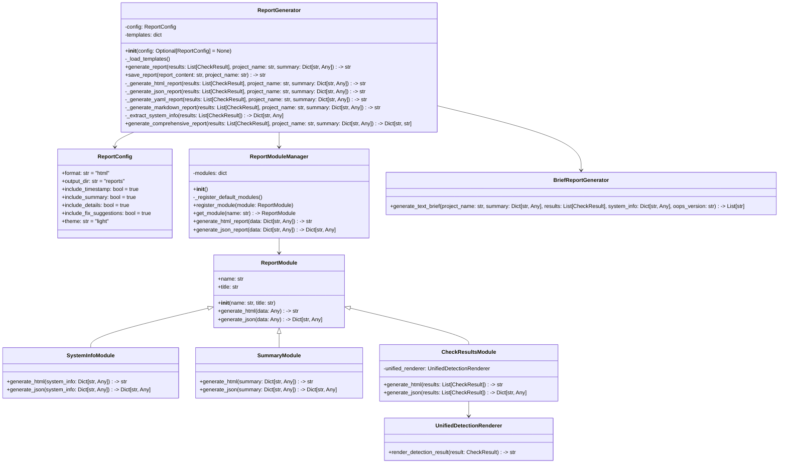
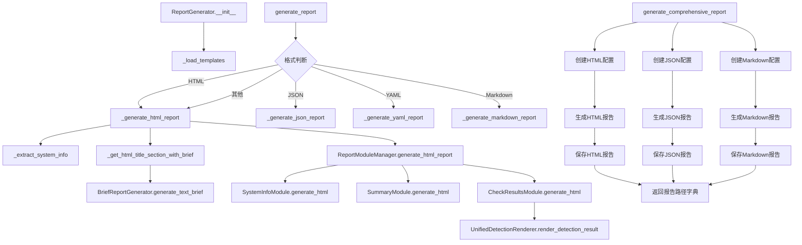
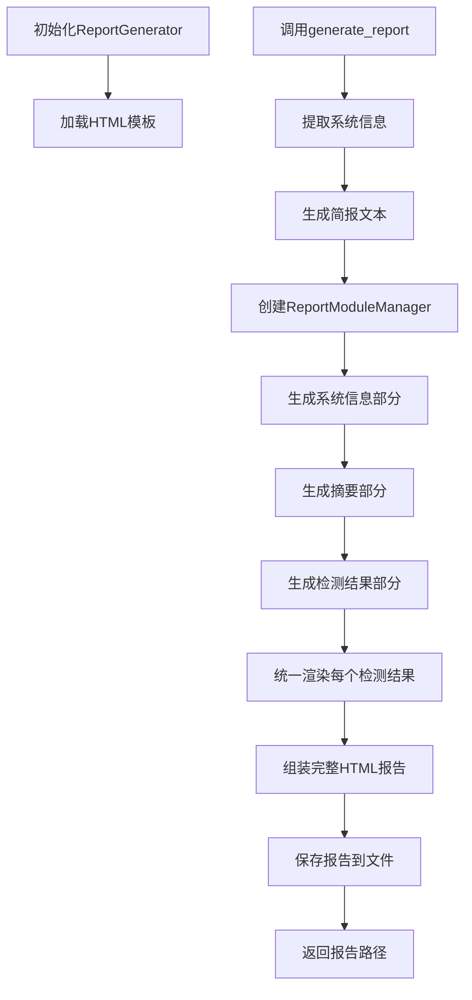
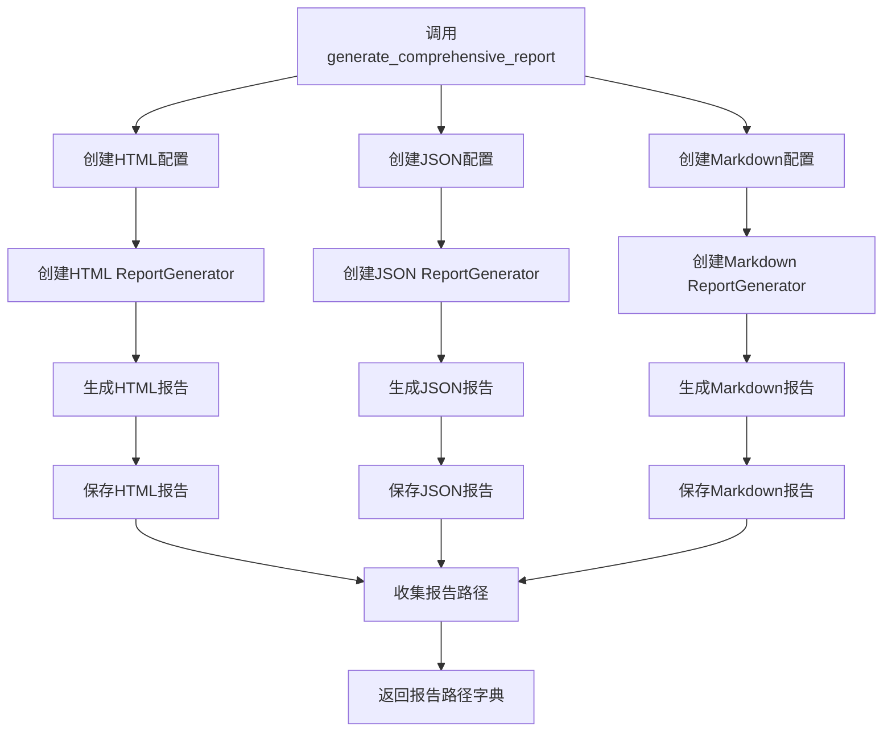
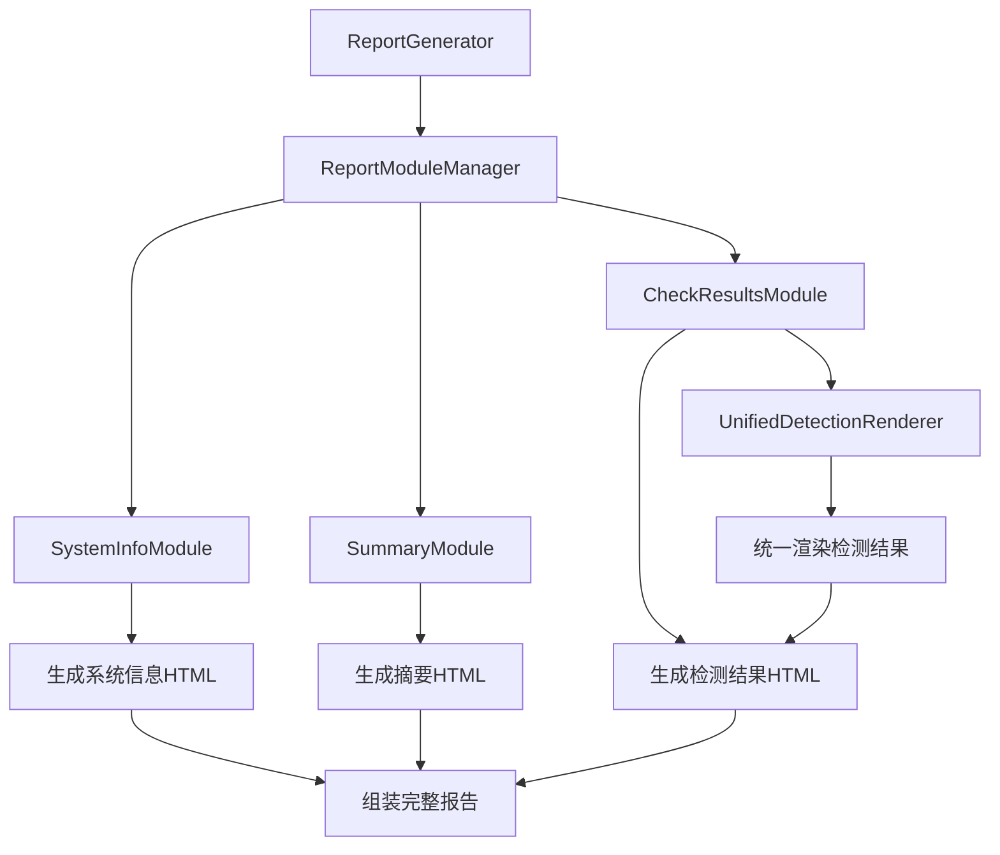

# ReportGenerator 内部关系分析报告

## 1. 核心类结构与属性

## 2. 方法调用关系

## 3. 报告生成的核心流程

### 3.1 HTML报告生成流程

### 3.2 综合报告生成流程

## 4. 模块化报告生成架构

## 5. 设计特点与优势

### 5.1 模块化设计
- 报告生成采用模块化架构，便于扩展和维护
- 支持动态添加新的报告模块
- 每个模块负责特定部分的报告生成

### 5.2 多格式支持
- 支持 HTML、JSON、YAML、Markdown 等多种报告格式
- 每种格式有独立的生成逻辑
- 支持一次性生成多种格式的综合报告

### 5.3 统一渲染
- 使用 UnifiedDetectionRenderer 统一渲染检测结果
- 确保所有检测结果的格式一致性
- 便于维护和修改报告样式

### 5.4 可配置性
- 通过 ReportConfig 类实现灵活的配置
- 支持自定义输出目录、时间戳、主题等
- 支持控制报告内容的包含与排除

### 5.5 扩展性
- 新的报告格式可以通过添加新的 `_generate_*_report` 方法实现
- 新的报告模块可以通过继承 ReportModule 类实现
- 新的检测结果类型可以通过扩展 UnifiedDetectionRenderer 支持

## 6. 总结

ReportGenerator 是 OOPS 项目中的核心报告生成模块，负责将诊断检测结果转换为各种格式的报告。其内部采用了模块化设计，支持多种报告格式，并通过统一渲染确保报告的一致性和美观性。

ReportGenerator 的主要优势在于：
1. **模块化架构**：便于扩展和维护，支持动态添加新的报告模块
2. **多格式支持**：满足不同场景需求，支持一次性生成多种格式的综合报告
3. **统一渲染**：确保报告格式一致性，便于维护和修改报告样式
4. **灵活配置**：支持自定义报告内容和样式
5. **良好的扩展性**：便于添加新的报告格式和模块

通过这种设计，ReportGenerator 能够高效地生成高质量的诊断报告，为用户提供清晰、直观的检测结果展示。